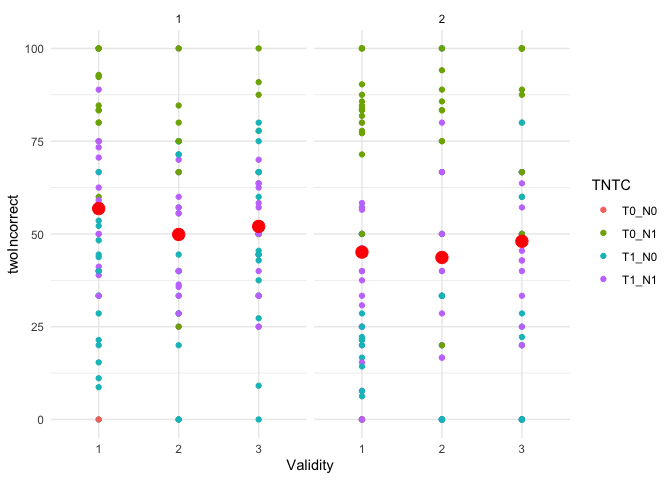

tazoot_swap_LMM_twoIncorrect
================
Jenny
2025-05-09

``` r
## Summary statistics
d <- data %>% group_by(Validity, Target, targetContrast, nontargetContrast) %>% 
  summarise(mean=mean(twoIncorrect), sd=sd(twoIncorrect), n=n_distinct(SID)) %>% mutate(se = sd / sqrt(n),
         ci.lower = mean - 1.96 * se,
         ci.upper = mean + 1.96 * se)
knitr::kable(d, digits=3, caption=sprintf("twoIncorrect swap"))
```

| Validity | Target | targetContrast | nontargetContrast |   mean |     sd |   n |    se | ci.lower | ci.upper |
|:---------|:-------|:---------------|:------------------|-------:|-------:|----:|------:|---------:|---------:|
| 1        | 1      | 1              | 1                 | 54.806 | 15.363 |  15 | 3.967 |   47.031 |   62.580 |
| 1        | 1      | 1              | 0                 | 33.196 | 18.119 |  15 | 4.678 |   24.027 |   42.366 |
| 1        | 1      | 0              | 1                 | 88.860 | 11.913 |  14 | 3.184 |   82.620 |   95.100 |
| 1        | 1      | 0              | 0                 |  0.000 |     NA |   1 |    NA |       NA |       NA |
| 1        | 2      | 1              | 1                 | 36.633 | 21.121 |  15 | 5.453 |   25.945 |   47.322 |
| 1        | 2      | 1              | 0                 | 24.617 | 18.992 |  15 | 4.904 |   15.006 |   34.228 |
| 1        | 2      | 0              | 1                 | 81.213 | 11.178 |  14 | 2.987 |   75.358 |   87.069 |
| 1        | 2      | 0              | 0                 |  0.000 |  0.000 |   3 | 0.000 |    0.000 |    0.000 |
| 2        | 1      | 1              | 1                 | 50.927 | 19.327 |  15 | 4.990 |   41.146 |   60.708 |
| 2        | 1      | 1              | 0                 | 41.440 | 25.327 |  14 | 6.769 |   28.173 |   54.707 |
| 2        | 1      | 0              | 1                 | 62.295 | 29.846 |  10 | 9.438 |   43.796 |   80.794 |
| 2        | 1      | 0              | 0                 |  0.000 |     NA |   1 |    NA |       NA |       NA |
| 2        | 2      | 1              | 1                 | 39.231 | 28.937 |  13 | 8.026 |   23.501 |   54.961 |
| 2        | 2      | 1              | 0                 | 22.619 | 31.762 |  14 | 8.489 |    5.981 |   39.257 |
| 2        | 2      | 0              | 1                 | 87.459 | 10.039 |   8 | 3.549 |   80.503 |   94.416 |
| 3        | 1      | 1              | 1                 | 48.811 | 13.988 |  15 | 3.612 |   41.732 |   55.890 |
| 3        | 1      | 1              | 0                 | 47.300 | 24.342 |  15 | 6.285 |   34.981 |   59.619 |
| 3        | 1      | 0              | 1                 | 70.476 | 17.965 |   6 | 7.334 |   56.101 |   84.851 |
| 3        | 2      | 1              | 1                 | 38.263 | 17.844 |  13 | 4.949 |   28.564 |   47.963 |
| 3        | 2      | 1              | 0                 | 26.922 | 28.125 |  14 | 7.517 |   12.189 |   41.655 |
| 3        | 2      | 0              | 1                 | 88.972 | 13.686 |  10 | 4.328 |   80.489 |   97.455 |
| 3        | 2      | 0              | 0                 |  0.000 |     NA |   1 |    NA |       NA |       NA |

twoIncorrect swap

``` r
library(ggplot2)
d <- data %>%
  mutate(TNTC = paste0("T", targetContrast, "_N", nontargetContrast))
ggplot(d, aes(x = Validity, y = twoIncorrect, color = TNTC)) + 
  geom_point() + stat_summary(
    fun = "mean",
    geom = "point",
    color = "red",
    size = 4
  ) +
  facet_grid(~Target) +
  theme_minimal()
```

<!-- -->
\# full model \## combined contrast

``` r
d <- data %>% mutate(combinedContrast = paste(targetContrast, nontargetContrast, sep = "_"))
d <- d %>%
  mutate(combinedContrast = factor(combinedContrast,
                                   levels =  c("1_1", "1_0", "0_1"),
                                   ordered = TRUE))
swap.lmm.lme4 <- lmer(twoIncorrect ~ Validity * Target * combinedContrast + (1|SID), data = d)
summary(swap.lmm.lme4)
```

    ## Linear mixed model fit by REML. t-tests use Satterthwaite's method [
    ## lmerModLmerTest]
    ## Formula: twoIncorrect ~ Validity * Target * combinedContrast + (1 | SID)
    ##    Data: d
    ## 
    ## REML criterion at convergence: 1990
    ## 
    ## Scaled residuals: 
    ##     Min      1Q  Median      3Q     Max 
    ## -2.9437 -0.5966  0.0016  0.5975  3.2156 
    ## 
    ## Random effects:
    ##  Groups   Name        Variance Std.Dev.
    ##  SID      (Intercept)  58.08    7.621  
    ##  Residual             385.50   19.634  
    ## Number of obs: 235, groups:  SID, 15
    ## 
    ## Fixed effects:
    ##                                        Estimate Std. Error       df t value
    ## (Intercept)                             51.9994     2.3772  14.7737  21.874
    ## Validity.L                              -0.2939     2.2710 204.2479  -0.129
    ## Validity.Q                               2.0788     2.3261 204.9235   0.894
    ## Target.L                                -4.2083     1.8780 204.7923  -2.241
    ## combinedContrast.L                      23.9831     2.4017 206.7825   9.986
    ## combinedContrast.Q                      23.7579     2.2088 204.7401  10.756
    ## Validity.L:Target.L                      3.6514     3.2127 204.3659   1.137
    ## Validity.Q:Target.L                     -3.0459     3.2917 205.1831  -0.925
    ## Validity.L:combinedContrast.L           -2.4811     4.0919 205.3493  -0.606
    ## Validity.Q:combinedContrast.L            4.1979     4.1842 204.8247   1.003
    ## Validity.L:combinedContrast.Q           -7.3215     3.7784 203.8301  -1.938
    ## Validity.Q:combinedContrast.Q            1.5714     3.8550 203.8983   0.408
    ## Target.L:combinedContrast.L             12.5861     3.3745 204.6251   3.730
    ## Target.L:combinedContrast.Q              8.6397     3.1201 204.2663   2.769
    ## Validity.L:Target.L:combinedContrast.L   6.6141     5.7708 204.4703   1.146
    ## Validity.Q:Target.L:combinedContrast.L  -6.0975     5.9140 204.6569  -1.031
    ## Validity.L:Target.L:combinedContrast.Q  11.9004     5.3486 204.1541   2.225
    ## Validity.Q:Target.L:combinedContrast.Q  -6.4532     5.4531 203.9670  -1.183
    ##                                        Pr(>|t|)    
    ## (Intercept)                            1.15e-12 ***
    ## Validity.L                             0.897146    
    ## Validity.Q                             0.372550    
    ## Target.L                               0.026112 *  
    ## combinedContrast.L                      < 2e-16 ***
    ## combinedContrast.Q                      < 2e-16 ***
    ## Validity.L:Target.L                    0.257049    
    ## Validity.Q:Target.L                    0.355875    
    ## Validity.L:combinedContrast.L          0.544953    
    ## Validity.Q:combinedContrast.L          0.316914    
    ## Validity.L:combinedContrast.Q          0.054040 .  
    ## Validity.Q:combinedContrast.Q          0.683977    
    ## Target.L:combinedContrast.L            0.000248 ***
    ## Target.L:combinedContrast.Q            0.006140 ** 
    ## Validity.L:Target.L:combinedContrast.L 0.253081    
    ## Validity.Q:Target.L:combinedContrast.L 0.303746    
    ## Validity.L:Target.L:combinedContrast.Q 0.027178 *  
    ## Validity.Q:Target.L:combinedContrast.Q 0.238022    
    ## ---
    ## Signif. codes:  0 '***' 0.001 '**' 0.01 '*' 0.05 '.' 0.1 ' ' 1

``` r
aov.swap <- Anova(swap.lmm.lme4)
print(aov.swap)
```

    ## Analysis of Deviance Table (Type II Wald chisquare tests)
    ## 
    ## Response: twoIncorrect
    ##                                     Chisq Df Pr(>Chisq)    
    ## Validity                           0.8862  2  0.6420323    
    ## Target                            11.8548  1  0.0005751 ***
    ## combinedContrast                 212.8646  2  < 2.2e-16 ***
    ## Validity:Target                    1.4975  2  0.4729565    
    ## Validity:combinedContrast          5.5321  4  0.2369221    
    ## Target:combinedContrast           15.8174  2  0.0003675 ***
    ## Validity:Target:combinedContrast   8.7333  4  0.0681230 .  
    ## ---
    ## Signif. codes:  0 '***' 0.001 '**' 0.01 '*' 0.05 '.' 0.1 ' ' 1

## targetContrast and nontargetContrast

``` r
d <- data 
swap.lmm.lme4 <- lmer(twoIncorrect ~ Validity * Target * targetContrast * nontargetContrast + (1|SID), data = d)
summary(swap.lmm.lme4)
```

    ## Linear mixed model fit by REML. t-tests use Satterthwaite's method [
    ## lmerModLmerTest]
    ## Formula: 
    ## twoIncorrect ~ Validity * Target * targetContrast * nontargetContrast +  
    ##     (1 | SID)
    ##    Data: d
    ## 
    ## REML criterion at convergence: 2015.8
    ## 
    ## Scaled residuals: 
    ##     Min      1Q  Median      3Q     Max 
    ## -2.9570 -0.5702  0.0000  0.5903  3.2299 
    ## 
    ## Random effects:
    ##  Groups   Name        Variance Std.Dev.
    ##  SID      (Intercept)  57.87    7.607  
    ##  Residual             381.95   19.544  
    ## Number of obs: 241, groups:  SID, 15
    ## 
    ## Fixed effects:
    ##                                                 Estimate Std. Error       df
    ## (Intercept)                                      37.0041     3.5140  60.8463
    ## Validity.L                                       -3.6918     4.7906 210.9184
    ## Validity.Q                                        0.7796     6.9009 208.7632
    ## Target.L                                         -1.3623     4.7455 209.2770
    ## targetContrast.L                                 -2.3538     4.1232 213.3435
    ## nontargetContrast.L                             -34.9170     4.0375 212.2546
    ## Validity.L:Target.L                               3.5594     4.0457 206.4262
    ## Validity.Q:Target.L                              -3.8750     4.1604 207.0958
    ## Validity.L:targetContrast.L                      -8.1594     6.7668 211.0110
    ## Validity.Q:targetContrast.L                       0.7082     9.7531 208.0567
    ## Target.L:targetContrast.L                        12.8159     6.7045 208.7375
    ## Validity.L:nontargetContrast.L                   -0.5747     6.5968 209.4433
    ## Validity.Q:nontargetContrast.L                   -2.7520     9.6897 208.3875
    ## Target.L:nontargetContrast.L                     -0.9567     6.5381 208.3079
    ## targetContrast.L:nontargetContrast.L            -37.2415     5.7161 212.3050
    ## Validity.L:Target.L:targetContrast.L              6.6123     5.7442 206.4107
    ## Validity.Q:Target.L:targetContrast.L             -6.0941     5.8868 206.6022
    ## Validity.L:Target.L:nontargetContrast.L          -6.9993     5.1201 205.4585
    ## Validity.Q:Target.L:nontargetContrast.L           2.5389     5.1968 205.5456
    ## Validity.L:targetContrast.L:nontargetContrast.L  -8.0250     9.3697 209.4616
    ## Validity.Q:targetContrast.L:nontargetContrast.L  -4.9350    13.6890 208.4135
    ## Target.L:targetContrast.L:nontargetContrast.L     0.3285     9.2043 208.2527
    ##                                                 t value Pr(>|t|)    
    ## (Intercept)                                      10.530 2.45e-15 ***
    ## Validity.L                                       -0.771   0.4418    
    ## Validity.Q                                        0.113   0.9102    
    ## Target.L                                         -0.287   0.7743    
    ## targetContrast.L                                 -0.571   0.5687    
    ## nontargetContrast.L                              -8.648 1.29e-15 ***
    ## Validity.L:Target.L                               0.880   0.3800    
    ## Validity.Q:Target.L                              -0.931   0.3527    
    ## Validity.L:targetContrast.L                      -1.206   0.2292    
    ## Validity.Q:targetContrast.L                       0.073   0.9422    
    ## Target.L:targetContrast.L                         1.912   0.0573 .  
    ## Validity.L:nontargetContrast.L                   -0.087   0.9307    
    ## Validity.Q:nontargetContrast.L                   -0.284   0.7767    
    ## Target.L:nontargetContrast.L                     -0.146   0.8838    
    ## targetContrast.L:nontargetContrast.L             -6.515 5.18e-10 ***
    ## Validity.L:Target.L:targetContrast.L              1.151   0.2510    
    ## Validity.Q:Target.L:targetContrast.L             -1.035   0.3018    
    ## Validity.L:Target.L:nontargetContrast.L          -1.367   0.1731    
    ## Validity.Q:Target.L:nontargetContrast.L           0.489   0.6257    
    ## Validity.L:targetContrast.L:nontargetContrast.L  -0.856   0.3927    
    ## Validity.Q:targetContrast.L:nontargetContrast.L  -0.361   0.7188    
    ## Target.L:targetContrast.L:nontargetContrast.L     0.036   0.9716    
    ## ---
    ## Signif. codes:  0 '***' 0.001 '**' 0.01 '*' 0.05 '.' 0.1 ' ' 1

    ## fit warnings:
    ## fixed-effect model matrix is rank deficient so dropping 2 columns / coefficients

``` r
aov.swap <- Anova(swap.lmm.lme4)
print(aov.swap)
```

    ## Analysis of Deviance Table (Type II Wald chisquare tests)
    ## 
    ## Response: twoIncorrect
    ##                                                    Chisq Df Pr(>Chisq)    
    ## Validity                                          0.9444  2  0.6236255    
    ## Target                                           11.7423  1  0.0006110 ***
    ## targetContrast                                   70.2330  1  < 2.2e-16 ***
    ## nontargetContrast                                48.0669  1  4.119e-12 ***
    ## Validity:Target                                   1.5067  2  0.4707902    
    ## Validity:targetContrast                           2.3867  2  0.3032080    
    ## Target:targetContrast                            12.6070  1  0.0003843 ***
    ## Validity:nontargetContrast                        1.3612  2  0.5063206    
    ## Target:nontargetContrast                          0.0580  1  0.8096688    
    ## targetContrast:nontargetContrast                 54.5046  1  1.551e-13 ***
    ## Validity:Target:targetContrast                    2.6907  2  0.2604495    
    ## Validity:Target:nontargetContrast                 2.1299  2  0.3447450    
    ## Validity:targetContrast:nontargetContrast         0.7356  2  0.6922599    
    ## Target:targetContrast:nontargetContrast           0.0013  1  0.9715311    
    ## Validity:Target:targetContrast:nontargetContrast          0               
    ## ---
    ## Signif. codes:  0 '***' 0.001 '**' 0.01 '*' 0.05 '.' 0.1 ' ' 1

## T1

``` r
d <- data %>% filter(Target==1)
swapT1.lmm.lme4 <- lmer(twoIncorrect ~ Validity * targetContrast * nontargetContrast + (1|SID), data = d)
summary(swapT1.lmm.lme4)
```

    ## Linear mixed model fit by REML. t-tests use Satterthwaite's method [
    ## lmerModLmerTest]
    ## Formula: twoIncorrect ~ Validity * targetContrast * nontargetContrast +  
    ##     (1 | SID)
    ##    Data: d
    ## 
    ## REML criterion at convergence: 989.6
    ## 
    ## Scaled residuals: 
    ##     Min      1Q  Median      3Q     Max 
    ## -3.1465 -0.6040  0.0000  0.6761  2.9784 
    ## 
    ## Random effects:
    ##  Groups   Name        Variance Std.Dev.
    ##  SID      (Intercept) 103.1    10.15   
    ##  Residual             297.8    17.26   
    ## Number of obs: 121, groups:  SID, 15
    ## 
    ## Fixed effects:
    ##                                                 Estimate Std. Error       df
    ## (Intercept)                                      39.7286     5.6505  83.5189
    ## Validity.L                                       -2.7755    10.1344 101.0794
    ## Validity.Q                                        5.1744     3.6696  97.8925
    ## targetContrast.L                                 -8.9165     7.0922 100.4102
    ## nontargetContrast.L                             -31.7261     6.9841  99.5563
    ## Validity.L:targetContrast.L                      -7.9797    14.3323 101.0794
    ## Validity.Q:targetContrast.L                       7.3358     5.1220  97.2870
    ## Validity.L:nontargetContrast.L                    9.6115    13.9831 100.4331
    ## Validity.Q:nontargetContrast.L                   -1.0361     4.5136  96.0978
    ## targetContrast.L:nontargetContrast.L            -33.9053     9.8949  99.5756
    ## Validity.L:targetContrast.L:nontargetContrast.L  -0.6188    19.7750 100.4331
    ##                                                 t value Pr(>|t|)    
    ## (Intercept)                                       7.031 5.18e-10 ***
    ## Validity.L                                       -0.274  0.78475    
    ## Validity.Q                                        1.410  0.16170    
    ## targetContrast.L                                 -1.257  0.21159    
    ## nontargetContrast.L                              -4.543 1.56e-05 ***
    ## Validity.L:targetContrast.L                      -0.557  0.57892    
    ## Validity.Q:targetContrast.L                       1.432  0.15529    
    ## Validity.L:nontargetContrast.L                    0.687  0.49344    
    ## Validity.Q:nontargetContrast.L                   -0.230  0.81893    
    ## targetContrast.L:nontargetContrast.L             -3.427  0.00089 ***
    ## Validity.L:targetContrast.L:nontargetContrast.L  -0.031  0.97510    
    ## ---
    ## Signif. codes:  0 '***' 0.001 '**' 0.01 '*' 0.05 '.' 0.1 ' ' 1
    ## 
    ## Correlation of Fixed Effects:
    ##              (Intr) Vldt.L Vldt.Q trgC.L nntC.L Vldty.L:tC.L Vldty.Q:tC.L
    ## Validity.L   0.638                                                       
    ## Validity.Q   0.274  0.352                                                
    ## trgtCntrs.L  0.827  0.721  0.316                                         
    ## nntrgtCnt.L  0.804  0.699  0.290  0.906                                  
    ## Vldty.L:tC.L 0.638  0.952  0.352  0.721  0.699                           
    ## Vldty.Q:tC.L 0.275  0.349  0.617  0.311  0.291  0.349                    
    ## Vldty.L:nC.L 0.617  0.930  0.301  0.698  0.712  0.930        0.297       
    ## Vldty.Q:nC.L 0.228  0.275  0.450  0.264  0.261  0.275        0.433       
    ## trgtC.L:C.L  0.803  0.700  0.297  0.908  0.931  0.700        0.292       
    ## V.L:C.L:C.L  0.617  0.930  0.301  0.698  0.712  0.930        0.297       
    ##              Vldty.L:nC.L Vldty.Q:nC.L tC.L:C
    ## Validity.L                                   
    ## Validity.Q                                   
    ## trgtCntrs.L                                  
    ## nntrgtCnt.L                                  
    ## Vldty.L:tC.L                                 
    ## Vldty.Q:tC.L                                 
    ## Vldty.L:nC.L                                 
    ## Vldty.Q:nC.L 0.280                           
    ## trgtC.L:C.L  0.713        0.267              
    ## V.L:C.L:C.L  0.949        0.280        0.713 
    ## fit warnings:
    ## fixed-effect model matrix is rank deficient so dropping 1 column / coefficient

``` r
aov.swapT1 <- Anova(swapT1.lmm.lme4)
print(aov.swapT1)
```

    ## Analysis of Deviance Table (Type II Wald chisquare tests)
    ## 
    ## Response: twoIncorrect
    ##                                             Chisq Df Pr(>Chisq)    
    ## Validity                                   2.2183  2    0.32985    
    ## targetContrast                            17.3247  1  3.151e-05 ***
    ## nontargetContrast                         21.0361  1  4.507e-06 ***
    ## Validity:targetContrast                    5.4547  2    0.06539 .  
    ## Validity:nontargetContrast                 5.3105  2    0.07028 .  
    ## targetContrast:nontargetContrast          23.5885  1  1.193e-06 ***
    ## Validity:targetContrast:nontargetContrast  0.0010  1    0.97503    
    ## ---
    ## Signif. codes:  0 '***' 0.001 '**' 0.01 '*' 0.05 '.' 0.1 ' ' 1

## T2

``` r
d <- data %>% filter(Target==2)
swapT2.lmm.lme4 <- lmer(twoIncorrect ~ Validity * targetContrast * nontargetContrast + (1|SID), data = d)
summary(swapT2.lmm.lme4)
```

    ## Linear mixed model fit by REML. t-tests use Satterthwaite's method [
    ## lmerModLmerTest]
    ## Formula: twoIncorrect ~ Validity * targetContrast * nontargetContrast +  
    ##     (1 | SID)
    ##    Data: d
    ## 
    ## REML criterion at convergence: 1015.1
    ## 
    ## Scaled residuals: 
    ##     Min      1Q  Median      3Q     Max 
    ## -2.0720 -0.7710 -0.0077  0.6095  3.2378 
    ## 
    ## Random effects:
    ##  Groups   Name        Variance Std.Dev.
    ##  SID      (Intercept)  43.42    6.59   
    ##  Residual             437.90   20.93   
    ## Number of obs: 120, groups:  SID, 15
    ## 
    ## Fixed effects:
    ##                                                 Estimate Std. Error       df
    ## (Intercept)                                      35.4443     4.0194  57.8401
    ## Validity.L                                        0.3408     5.0556 104.4216
    ## Validity.Q                                        0.4327     4.4936  98.3628
    ## targetContrast.L                                  5.9278     5.1515 103.5748
    ## nontargetContrast.L                             -36.9133     5.0445 102.5261
    ## Validity.L:targetContrast.L                      -1.1911     7.1536 104.6390
    ## Validity.Q:targetContrast.L                      -0.1126     6.4320  98.2438
    ## Validity.L:nontargetContrast.L                   -3.7869     7.1212 103.0865
    ## Validity.Q:nontargetContrast.L                    2.8328     5.6591  96.7111
    ## targetContrast.L:nontargetContrast.L            -39.1866     7.1121 102.7221
    ## Validity.L:targetContrast.L:nontargetContrast.L  -6.2532    10.0719 103.1020
    ##                                                 t value Pr(>|t|)    
    ## (Intercept)                                       8.818 2.71e-12 ***
    ## Validity.L                                        0.067    0.946    
    ## Validity.Q                                        0.096    0.923    
    ## targetContrast.L                                  1.151    0.253    
    ## nontargetContrast.L                              -7.318 5.82e-11 ***
    ## Validity.L:targetContrast.L                      -0.166    0.868    
    ## Validity.Q:targetContrast.L                      -0.018    0.986    
    ## Validity.L:nontargetContrast.L                   -0.532    0.596    
    ## Validity.Q:nontargetContrast.L                    0.501    0.618    
    ## targetContrast.L:nontargetContrast.L             -5.510 2.67e-07 ***
    ## Validity.L:targetContrast.L:nontargetContrast.L  -0.621    0.536    
    ## ---
    ## Signif. codes:  0 '***' 0.001 '**' 0.01 '*' 0.05 '.' 0.1 ' ' 1
    ## 
    ## Correlation of Fixed Effects:
    ##              (Intr) Vldt.L Vldt.Q trgC.L nntC.L Vldty.L:tC.L Vldty.Q:tC.L
    ## Validity.L    0.348                                                      
    ## Validity.Q   -0.269  0.020                                               
    ## trgtCntrs.L   0.727  0.371 -0.291                                        
    ## nntrgtCnt.L   0.682  0.357 -0.223  0.759                                 
    ## Vldty.L:tC.L  0.335  0.698  0.013  0.379  0.357                          
    ## Vldty.Q:tC.L -0.265  0.014  0.606 -0.302 -0.235  0.029                   
    ## Vldty.L:nC.L  0.329  0.659 -0.020  0.365  0.394  0.665       -0.012      
    ## Vldty.Q:nC.L -0.198 -0.004  0.429 -0.225 -0.237  0.005        0.453      
    ## trgtC.L:C.L   0.686  0.362 -0.219  0.753  0.793  0.354       -0.225      
    ## V.L:C.L:C.L   0.337  0.665 -0.025  0.366  0.389  0.659       -0.025      
    ##              Vldty.L:nC.L Vldty.Q:nC.L tC.L:C
    ## Validity.L                                   
    ## Validity.Q                                   
    ## trgtCntrs.L                                  
    ## nntrgtCnt.L                                  
    ## Vldty.L:tC.L                                 
    ## Vldty.Q:tC.L                                 
    ## Vldty.L:nC.L                                 
    ## Vldty.Q:nC.L  0.013                          
    ## trgtC.L:C.L   0.384       -0.223             
    ## V.L:C.L:C.L   0.695       -0.012        0.402
    ## fit warnings:
    ## fixed-effect model matrix is rank deficient so dropping 1 column / coefficient

``` r
aov.swapT2 <- Anova(swapT2.lmm.lme4)
print(aov.swapT2)
```

    ## Analysis of Deviance Table (Type II Wald chisquare tests)
    ## 
    ## Response: twoIncorrect
    ##                                             Chisq Df Pr(>Chisq)    
    ## Validity                                   0.4298  2     0.8066    
    ## targetContrast                            59.3736  1  1.304e-14 ***
    ## nontargetContrast                         28.8030  1  8.013e-08 ***
    ## Validity:targetContrast                    0.1065  2     0.9481    
    ## Validity:nontargetContrast                 0.2667  2     0.8752    
    ## targetContrast:nontargetContrast          33.0079  1  9.178e-09 ***
    ## Validity:targetContrast:nontargetContrast  0.3855  1     0.5347    
    ## ---
    ## Signif. codes:  0 '***' 0.001 '**' 0.01 '*' 0.05 '.' 0.1 ' ' 1

## TP

``` r
d <- data %>% filter(targetContrast==1)
swapTP.lmm.lme4 <- lmer(twoIncorrect ~ Validity * nontargetContrast + (1|SID), data = d)
summary(swapTP.lmm.lme4)
```

    ## Linear mixed model fit by REML. t-tests use Satterthwaite's method [
    ## lmerModLmerTest]
    ## Formula: twoIncorrect ~ Validity * nontargetContrast + (1 | SID)
    ##    Data: d
    ## 
    ## REML criterion at convergence: 1542.1
    ## 
    ## Scaled residuals: 
    ##      Min       1Q   Median       3Q      Max 
    ## -2.58054 -0.67066  0.00993  0.66909  2.70105 
    ## 
    ## Random effects:
    ##  Groups   Name        Variance Std.Dev.
    ##  SID      (Intercept)  71.8     8.474  
    ##  Residual             475.9    21.815  
    ## Number of obs: 173, groups:  SID, 15
    ## 
    ## Fixed effects:
    ##                                Estimate Std. Error       df t value Pr(>|t|)
    ## (Intercept)                     38.8640     2.7470  14.3503  14.148 7.97e-10
    ## Validity.L                       2.3458     2.8552 153.5741   0.822 0.412581
    ## Validity.Q                       0.2641     2.9012 154.1654   0.091 0.927599
    ## nontargetContrast.L             -8.6490     2.3487 153.6560  -3.682 0.000319
    ## Validity.L:nontargetContrast.L   5.2007     4.0384 153.6251   1.288 0.199748
    ## Validity.Q:nontargetContrast.L   1.0730     4.0976 153.6859   0.262 0.793782
    ##                                   
    ## (Intercept)                    ***
    ## Validity.L                        
    ## Validity.Q                        
    ## nontargetContrast.L            ***
    ## Validity.L:nontargetContrast.L    
    ## Validity.Q:nontargetContrast.L    
    ## ---
    ## Signif. codes:  0 '***' 0.001 '**' 0.01 '*' 0.05 '.' 0.1 ' ' 1
    ## 
    ## Correlation of Fixed Effects:
    ##             (Intr) Vldt.L Vldt.Q nntC.L V.L:C.
    ## Validity.L   0.013                            
    ## Validity.Q  -0.013  0.016                     
    ## nntrgtCnt.L -0.004 -0.008 -0.004              
    ## Vldty.L:C.L -0.005 -0.009 -0.006  0.022       
    ## Vldty.Q:C.L -0.003 -0.005 -0.003 -0.020  0.016

``` r
aov.swapTP <- Anova(swapTP.lmm.lme4)
print(aov.swapTP)
```

    ## Analysis of Deviance Table (Type II Wald chisquare tests)
    ## 
    ## Response: twoIncorrect
    ##                              Chisq Df Pr(>Chisq)    
    ## Validity                    0.7047  2  0.7030388    
    ## nontargetContrast          13.7460  1  0.0002093 ***
    ## Validity:nontargetContrast  1.7170  2  0.4238030    
    ## ---
    ## Signif. codes:  0 '***' 0.001 '**' 0.01 '*' 0.05 '.' 0.1 ' ' 1

## TP T1

``` r
d <- data %>% filter(Target==1, targetContrast==1)
swapTPT1.lmm.lme4 <- lmer(twoIncorrect ~ Validity * nontargetContrast + (1|SID), data = d)
summary(swapTPT1.lmm.lme4)
```

    ## Linear mixed model fit by REML. t-tests use Satterthwaite's method [
    ## lmerModLmerTest]
    ## Formula: twoIncorrect ~ Validity * nontargetContrast + (1 | SID)
    ##    Data: d
    ## 
    ## REML criterion at convergence: 743.7
    ## 
    ## Scaled residuals: 
    ##      Min       1Q   Median       3Q      Max 
    ## -2.02897 -0.67659 -0.01368  0.67969  2.93207 
    ## 
    ## Random effects:
    ##  Groups   Name        Variance Std.Dev.
    ##  SID      (Intercept)  92.12    9.598  
    ##  Residual             299.04   17.293  
    ## Number of obs: 89, groups:  SID, 15
    ## 
    ## Fixed effects:
    ##                                Estimate Std. Error       df t value Pr(>|t|)
    ## (Intercept)                    46.03100    3.08358 14.07823  14.928 5.03e-10
    ## Validity.L                      2.86701    3.15721 69.08707   0.908  0.36699
    ## Validity.Q                     -0.00668    3.19907 69.32203  -0.002  0.99834
    ## nontargetContrast.L            -7.75499    2.59500 69.20620  -2.988  0.00388
    ## Validity.L:nontargetContrast.L 10.04908    4.46497 69.08707   2.251  0.02759
    ## Validity.Q:nontargetContrast.L -1.02740    4.52417 69.32203  -0.227  0.82102
    ##                                   
    ## (Intercept)                    ***
    ## Validity.L                        
    ## Validity.Q                        
    ## nontargetContrast.L            ** 
    ## Validity.L:nontargetContrast.L *  
    ## Validity.Q:nontargetContrast.L    
    ## ---
    ## Signif. codes:  0 '***' 0.001 '**' 0.01 '*' 0.05 '.' 0.1 ' ' 1
    ## 
    ## Correlation of Fixed Effects:
    ##             (Intr) Vldt.L Vldt.Q nntC.L V.L:C.
    ## Validity.L   0.000                            
    ## Validity.Q  -0.011  0.000                     
    ## nntrgtCnt.L  0.008  0.000 -0.019              
    ## Vldty.L:C.L  0.000  0.000  0.000  0.000       
    ## Vldty.Q:C.L -0.011  0.000  0.026 -0.019  0.000

``` r
aov.swapTPT1 <- Anova(swapTPT1.lmm.lme4)
print(aov.swapTPT1)
```

    ## Analysis of Deviance Table (Type II Wald chisquare tests)
    ## 
    ## Response: twoIncorrect
    ##                             Chisq Df Pr(>Chisq)   
    ## Validity                   0.8246  2   0.662114   
    ## nontargetContrast          8.9590  1   0.002761 **
    ## Validity:nontargetContrast 5.1170  2   0.077421 . 
    ## ---
    ## Signif. codes:  0 '***' 0.001 '**' 0.01 '*' 0.05 '.' 0.1 ' ' 1

## TP T2

``` r
d <- data %>% filter(Target==2, targetContrast==1)
swapTPT2.lmm.lme4 <- lmer(twoIncorrect ~ Validity * nontargetContrast + (1|SID), data = d)
summary(swapTPT2.lmm.lme4)
```

    ## Linear mixed model fit by REML. t-tests use Satterthwaite's method [
    ## lmerModLmerTest]
    ## Formula: twoIncorrect ~ Validity * nontargetContrast + (1 | SID)
    ##    Data: d
    ## 
    ## REML criterion at convergence: 739
    ## 
    ## Scaled residuals: 
    ##      Min       1Q   Median       3Q      Max 
    ## -2.04600 -0.72543 -0.02734  0.67168  2.60677 
    ## 
    ## Random effects:
    ##  Groups   Name        Variance Std.Dev.
    ##  SID      (Intercept) 107.9    10.39   
    ##  Residual             512.7    22.64   
    ## Number of obs: 84, groups:  SID, 15
    ## 
    ## Fixed effects:
    ##                                Estimate Std. Error      df t value Pr(>|t|)    
    ## (Intercept)                     31.1398     3.6563 14.3950   8.517 5.35e-07 ***
    ## Validity.L                       0.9674     4.2594 65.0445   0.227    0.821    
    ## Validity.Q                       0.4153     4.3583 66.4078   0.095    0.924    
    ## nontargetContrast.L             -9.0734     3.5088 65.0627  -2.586    0.012 *  
    ## Validity.L:nontargetContrast.L   0.8263     6.0271 65.1799   0.137    0.891    
    ## Validity.Q:nontargetContrast.L   2.8442     6.1293 65.0344   0.464    0.644    
    ## ---
    ## Signif. codes:  0 '***' 0.001 '**' 0.01 '*' 0.05 '.' 0.1 ' ' 1
    ## 
    ## Correlation of Fixed Effects:
    ##             (Intr) Vldt.L Vldt.Q nntC.L V.L:C.
    ## Validity.L   0.031                            
    ## Validity.Q  -0.020  0.034                     
    ## nntrgtCnt.L -0.019 -0.017  0.010              
    ## Vldty.L:C.L -0.011 -0.021 -0.013  0.048       
    ## Vldty.Q:C.L  0.007 -0.013 -0.035 -0.023  0.034

``` r
aov.swapTPT2 <- Anova(swapTPT2.lmm.lme4)
print(aov.swapTPT2)
```

    ## Analysis of Deviance Table (Type II Wald chisquare tests)
    ## 
    ## Response: twoIncorrect
    ##                             Chisq Df Pr(>Chisq)   
    ## Validity                   0.0666  2   0.967261   
    ## nontargetContrast          6.6808  1   0.009746 **
    ## Validity:nontargetContrast 0.2301  2   0.891327   
    ## ---
    ## Signif. codes:  0 '***' 0.001 '**' 0.01 '*' 0.05 '.' 0.1 ' ' 1

## TA

``` r
d <- data %>% filter(targetContrast==0)
swapTA.lmm.lme4 <- lmer(twoIncorrect ~ Validity  * nontargetContrast + (1|SID), data = d)
summary(swapTA.lmm.lme4)
```

    ## Linear mixed model fit by REML. t-tests use Satterthwaite's method [
    ## lmerModLmerTest]
    ## Formula: twoIncorrect ~ Validity * nontargetContrast + (1 | SID)
    ##    Data: d
    ## 
    ## REML criterion at convergence: 548.5
    ## 
    ## Scaled residuals: 
    ##     Min      1Q  Median      3Q     Max 
    ## -3.9988 -0.2869  0.0419  0.5368  1.5154 
    ## 
    ## Random effects:
    ##  Groups   Name        Variance Std.Dev.
    ##  SID      (Intercept)  13.62    3.691  
    ##  Residual             309.52   17.593  
    ## Number of obs: 68, groups:  SID, 15
    ## 
    ## Fixed effects:
    ##                                Estimate Std. Error       df t value Pr(>|t|)
    ## (Intercept)                     39.6164     4.7830  40.1695   8.283 3.18e-10
    ## Validity.L                      -1.8598     7.3773  61.9925  -0.252    0.802
    ## Validity.Q                       4.5297     8.5126  53.3614   0.532    0.597
    ## nontargetContrast.L            -57.1865     6.5919  61.7835  -8.675 2.76e-12
    ## Validity.L:nontargetContrast.L   0.6187    10.3726  60.6740   0.060    0.953
    ## Validity.Q:nontargetContrast.L  -5.2447    12.0477  54.0671  -0.435    0.665
    ##                                   
    ## (Intercept)                    ***
    ## Validity.L                        
    ## Validity.Q                        
    ## nontargetContrast.L            ***
    ## Validity.L:nontargetContrast.L    
    ## Validity.Q:nontargetContrast.L    
    ## ---
    ## Signif. codes:  0 '***' 0.001 '**' 0.01 '*' 0.05 '.' 0.1 ' ' 1
    ## 
    ## Correlation of Fixed Effects:
    ##             (Intr) Vldt.L Vldt.Q nntC.L V.L:C.
    ## Validity.L   0.435                            
    ## Validity.Q  -0.215  0.258                     
    ## nntrgtCnt.L  0.858  0.411 -0.210              
    ## Vldty.L:C.L  0.406  0.858  0.243  0.442       
    ## Vldty.Q:C.L -0.205  0.237  0.885 -0.215  0.261

``` r
aov.swapTA <- Anova(swapTA.lmm.lme4)
print(aov.swapTA)
```

    ## Analysis of Deviance Table (Type II Wald chisquare tests)
    ## 
    ## Response: twoIncorrect
    ##                               Chisq Df Pr(>Chisq)    
    ## Validity                     4.6728  2    0.09668 .  
    ## nontargetContrast          114.1064  1    < 2e-16 ***
    ## Validity:nontargetContrast   0.2217  2    0.89506    
    ## ---
    ## Signif. codes:  0 '***' 0.001 '**' 0.01 '*' 0.05 '.' 0.1 ' ' 1

## TA T1

``` r
d <- data %>% filter(Target==1, targetContrast==0)
swapTAT1.lmm.lme4 <- lmer(twoIncorrect ~ Validity * nontargetContrast + (1|SID), data = d)
summary(swapTAT1.lmm.lme4)
```

    ## Linear mixed model fit by REML. t-tests use Satterthwaite's method [
    ## lmerModLmerTest]
    ## Formula: twoIncorrect ~ Validity * nontargetContrast + (1 | SID)
    ##    Data: d
    ## 
    ## REML criterion at convergence: 245.8
    ## 
    ## Scaled residuals: 
    ##      Min       1Q   Median       3Q      Max 
    ## -2.26855 -0.35093  0.07795  0.50741  1.45935 
    ## 
    ## Random effects:
    ##  Groups   Name        Variance Std.Dev.
    ##  SID      (Intercept) 173.3    13.16   
    ##  Residual             251.8    15.87   
    ## Number of obs: 32, groups:  SID, 15
    ## 
    ## Fixed effects:
    ##                                Estimate Std. Error      df t value Pr(>|t|)    
    ## (Intercept)                      33.640      9.951  24.263   3.380 0.002448 ** 
    ## Validity.L                       -5.335     19.188  19.146  -0.278 0.783982    
    ## Validity.Q                       11.722      5.446  17.010   2.153 0.046003 *  
    ## nontargetContrast.L             -54.336     12.840  17.157  -4.232 0.000551 ***
    ## Validity.L:nontargetContrast.L   16.726     26.157  18.559   0.639 0.530354    
    ## ---
    ## Signif. codes:  0 '***' 0.001 '**' 0.01 '*' 0.05 '.' 0.1 ' ' 1
    ## 
    ## Correlation of Fixed Effects:
    ##             (Intr) Vldt.L Vldt.Q nntC.L
    ## Validity.L  0.678                      
    ## Validity.Q  0.247  0.320               
    ## nntrgtCnt.L 0.878  0.697  0.240        
    ## Vldty.L:C.L 0.649  0.953  0.252  0.711 
    ## fit warnings:
    ## fixed-effect model matrix is rank deficient so dropping 1 column / coefficient

``` r
aov.swapTAT1 <- Anova(swapTAT1.lmm.lme4)
print(aov.swapTAT1)
```

    ## Analysis of Deviance Table (Type II Wald chisquare tests)
    ## 
    ## Response: twoIncorrect
    ##                              Chisq Df Pr(>Chisq)    
    ## Validity                   17.3104  2  0.0001742 ***
    ## nontargetContrast          44.3976  1   2.68e-11 ***
    ## Validity:nontargetContrast  0.4089  1  0.5225392    
    ## ---
    ## Signif. codes:  0 '***' 0.001 '**' 0.01 '*' 0.05 '.' 0.1 ' ' 1

## TA T2

``` r
d <- data %>% filter(Target==2, targetContrast==0)
swapTAT2.lmm.lme4 <- lmer(twoIncorrect ~ Validity * nontargetContrast + (1|SID), data = d)
summary(swapTAT2.lmm.lme4)
```

    ## Linear mixed model fit by REML. t-tests use Satterthwaite's method [
    ## lmerModLmerTest]
    ## Formula: twoIncorrect ~ Validity * nontargetContrast + (1 | SID)
    ##    Data: d
    ## 
    ## REML criterion at convergence: 250.1
    ## 
    ## Scaled residuals: 
    ##      Min       1Q   Median       3Q      Max 
    ## -2.74253 -0.35886  0.02657  0.63888  1.65068 
    ## 
    ## Random effects:
    ##  Groups   Name        Variance Std.Dev.
    ##  SID      (Intercept)   0.0     0.00   
    ##  Residual             129.5    11.38   
    ## Number of obs: 36, groups:  SID, 14
    ## 
    ## Fixed effects:
    ##                                Estimate Std. Error      df t value Pr(>|t|)    
    ## (Intercept)                      43.335      3.570  31.000  12.137 2.59e-13 ***
    ## Validity.L                        2.743      4.936  31.000   0.556    0.582    
    ## Validity.Q                       -1.932      3.807  31.000  -0.507    0.615    
    ## nontargetContrast.L             -60.170      4.936  31.000 -12.190 2.32e-13 ***
    ## Validity.L:nontargetContrast.L   -3.879      6.981  31.000  -0.556    0.582    
    ## ---
    ## Signif. codes:  0 '***' 0.001 '**' 0.01 '*' 0.05 '.' 0.1 ' ' 1
    ## 
    ## Correlation of Fixed Effects:
    ##             (Intr) Vldt.L Vldt.Q nntC.L
    ## Validity.L   0.439                     
    ## Validity.Q  -0.269  0.028              
    ## nntrgtCnt.L  0.829  0.424 -0.171       
    ## Vldty.L:C.L  0.427  0.772 -0.028  0.462
    ## fit warnings:
    ## fixed-effect model matrix is rank deficient so dropping 1 column / coefficient
    ## optimizer (nloptwrap) convergence code: 0 (OK)
    ## boundary (singular) fit: see help('isSingular')

``` r
aov.swapTAT2 <- Anova(swapTAT2.lmm.lme4)
print(aov.swapTAT2)
```

    ## Analysis of Deviance Table (Type II Wald chisquare tests)
    ## 
    ## Response: twoIncorrect
    ##                               Chisq Df Pr(>Chisq)    
    ## Validity                     2.8227  2     0.2438    
    ## nontargetContrast          181.0474  1     <2e-16 ***
    ## Validity:nontargetContrast   0.3089  1     0.5784    
    ## ---
    ## Signif. codes:  0 '***' 0.001 '**' 0.01 '*' 0.05 '.' 0.1 ' ' 1

## NP

``` r
d <- data %>% filter(nontargetContrast==1)
swapNP.lmm.lme4 <- lmer(twoIncorrect ~ Validity * targetContrast + (1|SID), data = d)
summary(swapNP.lmm.lme4)
```

    ## Linear mixed model fit by REML. t-tests use Satterthwaite's method [
    ## lmerModLmerTest]
    ## Formula: twoIncorrect ~ Validity * targetContrast + (1 | SID)
    ##    Data: d
    ## 
    ## REML criterion at convergence: 1271.4
    ## 
    ## Scaled residuals: 
    ##     Min      1Q  Median      3Q     Max 
    ## -3.5903 -0.4650  0.0927  0.5788  2.8830 
    ## 
    ## Random effects:
    ##  Groups   Name        Variance Std.Dev.
    ##  SID      (Intercept)  27.15    5.21   
    ##  Residual             364.04   19.08   
    ## Number of obs: 148, groups:  SID, 15
    ## 
    ## Fixed effects:
    ##                             Estimate Std. Error       df t value Pr(>|t|)    
    ## (Intercept)                  62.3675     2.1157  16.5364  29.479 9.91e-16 ***
    ## Validity.L                   -1.9708     2.7668 131.5336  -0.712    0.478    
    ## Validity.Q                    3.8656     2.8538 132.4090   1.355    0.178    
    ## targetContrast.L             24.5253     2.3079 135.2086  10.627  < 2e-16 ***
    ## Validity.L:targetContrast.L  -0.9774     3.9207 132.7092  -0.249    0.804    
    ## Validity.Q:targetContrast.L   6.1974     4.0347 132.2211   1.536    0.127    
    ## ---
    ## Signif. codes:  0 '***' 0.001 '**' 0.01 '*' 0.05 '.' 0.1 ' ' 1
    ## 
    ## Correlation of Fixed Effects:
    ##             (Intr) Vldt.L Vldt.Q trgC.L V.L:C.
    ## Validity.L   0.113                            
    ## Validity.Q  -0.036  0.098                     
    ## trgtCntrs.L  0.157  0.123 -0.034              
    ## Vldty.L:C.L  0.097  0.180  0.080  0.149       
    ## Vldty.Q:C.L -0.021  0.085  0.208 -0.041  0.101

``` r
aov.swapNP <- Anova(swapNP.lmm.lme4)
print(aov.swapNP)
```

    ## Analysis of Deviance Table (Type II Wald chisquare tests)
    ## 
    ## Response: twoIncorrect
    ##                            Chisq Df Pr(>Chisq)    
    ## Validity                  1.9306  2     0.3809    
    ## targetContrast          118.6135  1     <2e-16 ***
    ## Validity:targetContrast   2.5241  2     0.2831    
    ## ---
    ## Signif. codes:  0 '***' 0.001 '**' 0.01 '*' 0.05 '.' 0.1 ' ' 1

## NP T1

``` r
d <- data %>% filter(Target==1, nontargetContrast==1)
swapNPT1.lmm.lme4 <- lmer(twoIncorrect ~ Validity * targetContrast + (1|SID), data = d)
summary(swapNPT1.lmm.lme4)
```

    ## Linear mixed model fit by REML. t-tests use Satterthwaite's method [
    ## lmerModLmerTest]
    ## Formula: twoIncorrect ~ Validity * targetContrast + (1 | SID)
    ##    Data: d
    ## 
    ## REML criterion at convergence: 612.4
    ## 
    ## Scaled residuals: 
    ##     Min      1Q  Median      3Q     Max 
    ## -3.2882 -0.6699  0.0595  0.6328  2.8096 
    ## 
    ## Random effects:
    ##  Groups   Name        Variance Std.Dev.
    ##  SID      (Intercept)  49.21    7.015  
    ##  Residual             279.73   16.725  
    ## Number of obs: 75, groups:  SID, 15
    ## 
    ## Fixed effects:
    ##                             Estimate Std. Error     df t value Pr(>|t|)    
    ## (Intercept)                   62.279      2.756 15.939  22.596 1.57e-13 ***
    ## Validity.L                    -9.404      3.648 58.647  -2.578   0.0125 *  
    ## Validity.Q                     6.817      3.510 57.925   1.942   0.0570 .  
    ## targetContrast.L              15.223      2.938 59.560   5.181 2.75e-06 ***
    ## Validity.L:targetContrast.L   -7.305      5.159 58.647  -1.416   0.1621    
    ## Validity.Q:targetContrast.L    8.622      4.964 57.925   1.737   0.0877 .  
    ## ---
    ## Signif. codes:  0 '***' 0.001 '**' 0.01 '*' 0.05 '.' 0.1 ' ' 1
    ## 
    ## Correlation of Fixed Effects:
    ##             (Intr) Vldt.L Vldt.Q trgC.L V.L:C.
    ## Validity.L  0.174                             
    ## Validity.Q  0.040  0.158                      
    ## trgtCntrs.L 0.211  0.231  0.054               
    ## Vldty.L:C.L 0.174  0.299  0.158  0.231        
    ## Vldty.Q:C.L 0.040  0.158  0.243  0.054  0.158

``` r
aov.swapNPT1 <- Anova(swapNPT1.lmm.lme4)
print(aov.swapNPT1)
```

    ## Analysis of Deviance Table (Type II Wald chisquare tests)
    ## 
    ## Response: twoIncorrect
    ##                           Chisq Df Pr(>Chisq)    
    ## Validity                10.4613  2    0.00535 ** 
    ## targetContrast          31.6796  1  1.818e-08 ***
    ## Validity:targetContrast  5.9502  2    0.05104 .  
    ## ---
    ## Signif. codes:  0 '***' 0.001 '**' 0.01 '*' 0.05 '.' 0.1 ' ' 1

## NP T2

``` r
d <- data %>% filter(Target==2,nontargetContrast==1)
swapNPT2.lmm.lme4 <- lmer(twoIncorrect ~ Validity * targetContrast + (1|SID), data = d)
summary(swapNPT2.lmm.lme4)
```

    ## Linear mixed model fit by REML. t-tests use Satterthwaite's method [
    ## lmerModLmerTest]
    ## Formula: twoIncorrect ~ Validity * targetContrast + (1 | SID)
    ##    Data: d
    ## 
    ## REML criterion at convergence: 603.5
    ## 
    ## Scaled residuals: 
    ##     Min      1Q  Median      3Q     Max 
    ## -2.0827 -0.6368  0.1054  0.5799  3.2049 
    ## 
    ## Random effects:
    ##  Groups   Name        Variance Std.Dev.
    ##  SID      (Intercept)  12.32    3.51   
    ##  Residual             347.75   18.65   
    ## Number of obs: 73, groups:  SID, 15
    ## 
    ## Fixed effects:
    ##                             Estimate Std. Error      df t value Pr(>|t|)    
    ## (Intercept)                  61.8159     2.4238 14.5129  25.503 1.84e-13 ***
    ## Validity.L                    3.2958     3.7058 56.1074   0.889    0.378    
    ## Validity.Q                   -1.4849     4.0490 58.8438  -0.367    0.715    
    ## targetContrast.L             33.7292     3.1749 59.6587  10.624 2.21e-15 ***
    ## Validity.L:targetContrast.L   3.1447     5.2455 57.1392   0.599    0.551    
    ## Validity.Q:targetContrast.L  -0.1103     5.7187 57.3845  -0.019    0.985    
    ## ---
    ## Signif. codes:  0 '***' 0.001 '**' 0.01 '*' 0.05 '.' 0.1 ' ' 1
    ## 
    ## Correlation of Fixed Effects:
    ##             (Intr) Vldt.L Vldt.Q trgC.L V.L:C.
    ## Validity.L   0.091                            
    ## Validity.Q  -0.113  0.065                     
    ## trgtCntrs.L  0.143  0.047 -0.095              
    ## Vldty.L:C.L  0.045  0.090  0.028  0.101       
    ## Vldty.Q:C.L -0.083  0.031  0.198 -0.117  0.066

``` r
aov.swapNPT2 <- Anova(swapNPT2.lmm.lme4)
print(aov.swapNPT2)
```

    ## Analysis of Deviance Table (Type II Wald chisquare tests)
    ## 
    ## Response: twoIncorrect
    ##                            Chisq Df Pr(>Chisq)    
    ## Validity                  0.8917  2     0.6403    
    ## targetContrast          114.3597  1     <2e-16 ***
    ## Validity:targetContrast   0.3629  2     0.8341    
    ## ---
    ## Signif. codes:  0 '***' 0.001 '**' 0.01 '*' 0.05 '.' 0.1 ' ' 1

## NA

``` r
d <- data %>% filter(nontargetContrast==0)
swapNA.lmm.lme4 <- lmer(twoIncorrect ~ Validity  * targetContrast + (1|SID), data = d)
summary(swapNA.lmm.lme4)
```

    ## Linear mixed model fit by REML. t-tests use Satterthwaite's method [
    ## lmerModLmerTest]
    ## Formula: twoIncorrect ~ Validity * targetContrast + (1 | SID)
    ##    Data: d
    ## 
    ## REML criterion at convergence: 815.5
    ## 
    ## Scaled residuals: 
    ##      Min       1Q   Median       3Q      Max 
    ## -1.91085 -0.57888  0.03036  0.52532  2.17436 
    ## 
    ## Random effects:
    ##  Groups   Name        Variance Std.Dev.
    ##  SID      (Intercept) 166.5    12.90   
    ##  Residual             480.1    21.91   
    ## Number of obs: 93, groups:  SID, 15
    ## 
    ## Fixed effects:
    ##                             Estimate Std. Error      df t value Pr(>|t|)    
    ## (Intercept)                    8.783      6.942  61.303   1.265 0.210607    
    ## Validity.L                    -5.277      9.409  80.053  -0.561 0.576516    
    ## Validity.Q                     5.341     10.610  75.153   0.503 0.616195    
    ## targetContrast.L             -33.905      8.610  82.426  -3.938 0.000171 ***
    ## Validity.L:targetContrast.L  -16.048     13.307  80.059  -1.206 0.231378    
    ## Validity.Q:targetContrast.L    6.021     14.983  74.944   0.402 0.688929    
    ## ---
    ## Signif. codes:  0 '***' 0.001 '**' 0.01 '*' 0.05 '.' 0.1 ' ' 1
    ## 
    ## Correlation of Fixed Effects:
    ##             (Intr) Vldt.L Vldt.Q trgC.L V.L:C.
    ## Validity.L   0.405                            
    ## Validity.Q  -0.208  0.205                     
    ## trgtCntrs.L  0.812  0.459 -0.234              
    ## Vldty.L:C.L  0.403  0.908  0.204  0.459       
    ## Vldty.Q:C.L -0.207  0.207  0.925 -0.237  0.208

``` r
aov.swapNA <- Anova(swapNA.lmm.lme4)
print(aov.swapNA)
```

    ## Analysis of Deviance Table (Type II Wald chisquare tests)
    ## 
    ## Response: twoIncorrect
    ##                           Chisq Df Pr(>Chisq)    
    ## Validity                 1.6841  2  0.4308299    
    ## targetContrast          14.7984  1  0.0001196 ***
    ## Validity:targetContrast  1.8995  2  0.3868413    
    ## ---
    ## Signif. codes:  0 '***' 0.001 '**' 0.01 '*' 0.05 '.' 0.1 ' ' 1

## NA T1

``` r
d <- data %>% filter(Target==1, nontargetContrast==0)
swapNAT1.lmm.lme4 <- lmer(twoIncorrect ~ Validity * targetContrast + (1|SID), data = d)
summary(swapNAT1.lmm.lme4)
```

    ## Linear mixed model fit by REML. t-tests use Satterthwaite's method [
    ## lmerModLmerTest]
    ## Formula: twoIncorrect ~ Validity * targetContrast + (1 | SID)
    ##    Data: d
    ## 
    ## REML criterion at convergence: 372.6
    ## 
    ## Scaled residuals: 
    ##      Min       1Q   Median       3Q      Max 
    ## -1.96952 -0.54443 -0.00096  0.60158  1.75044 
    ## 
    ## Random effects:
    ##  Groups   Name        Variance Std.Dev.
    ##  SID      (Intercept) 260.7    16.15   
    ##  Residual             253.4    15.92   
    ## Number of obs: 46, groups:  SID, 15
    ## 
    ## Fixed effects:
    ##                             Estimate Std. Error       df t value Pr(>|t|)   
    ## (Intercept)                  12.0705     9.9923  40.3548   1.208  0.23409   
    ## Validity.L                   -4.5223    18.3007  30.6102  -0.247  0.80647   
    ## Validity.Q                   -0.7017     4.2390  27.5340  -0.166  0.86973   
    ## targetContrast.L            -40.2543    12.8600  30.3888  -3.130  0.00384 **
    ## Validity.L:targetContrast.L -20.4992    25.8811  30.6102  -0.792  0.43442   
    ## ---
    ## Signif. codes:  0 '***' 0.001 '**' 0.01 '*' 0.05 '.' 0.1 ' ' 1
    ## 
    ## Correlation of Fixed Effects:
    ##             (Intr) Vldt.L Vldt.Q trgC.L
    ## Validity.L  0.646                      
    ## Validity.Q  0.164  0.201               
    ## trgtCntrs.L 0.877  0.712  0.192        
    ## Vldty.L:C.L 0.646  0.975  0.201  0.712 
    ## fit warnings:
    ## fixed-effect model matrix is rank deficient so dropping 1 column / coefficient

``` r
aov.swapNAT1 <- Anova(swapNAT1.lmm.lme4)
print(aov.swapNAT1)
```

    ## Analysis of Deviance Table (Type II Wald chisquare tests)
    ## 
    ## Response: twoIncorrect
    ##                           Chisq Df Pr(>Chisq)    
    ## Validity                 5.5368  2  0.0627625 .  
    ## targetContrast          13.3686  1  0.0002559 ***
    ## Validity:targetContrast  0.6273  1  0.4283293    
    ## ---
    ## Signif. codes:  0 '***' 0.001 '**' 0.01 '*' 0.05 '.' 0.1 ' ' 1

## NA T2

``` r
d <- data %>% filter(Target==2, nontargetContrast==0)
swapNAT2.lmm.lme4 <- lmer(twoIncorrect ~ Validity * targetContrast + (1|SID), data = d)
summary(swapNAT2.lmm.lme4)
```

    ## Linear mixed model fit by REML. t-tests use Satterthwaite's method [
    ## lmerModLmerTest]
    ## Formula: twoIncorrect ~ Validity * targetContrast + (1 | SID)
    ##    Data: d
    ## 
    ## REML criterion at convergence: 396.2
    ## 
    ## Scaled residuals: 
    ##      Min       1Q   Median       3Q      Max 
    ## -1.64543 -0.53423 -0.07804  0.35634  2.25071 
    ## 
    ## Random effects:
    ##  Groups   Name        Variance Std.Dev.
    ##  SID      (Intercept) 327.6    18.10   
    ##  Residual             350.4    18.72   
    ## Number of obs: 47, groups:  SID, 15
    ## 
    ## Fixed effects:
    ##                             Estimate Std. Error      df t value Pr(>|t|)    
    ## (Intercept)                    2.639      7.735  35.731   0.341 0.734982    
    ## Validity.L                   -10.366      8.902  32.033  -1.164 0.252848    
    ## Validity.Q                     2.384      5.017  28.491   0.475 0.638343    
    ## targetContrast.L             -31.648      8.714  31.226  -3.632 0.000997 ***
    ## Validity.L:targetContrast.L  -17.406     12.592  32.052  -1.382 0.176439    
    ## ---
    ## Signif. codes:  0 '***' 0.001 '**' 0.01 '*' 0.05 '.' 0.1 ' ' 1
    ## 
    ## Correlation of Fixed Effects:
    ##             (Intr) Vldt.L Vldt.Q trgC.L
    ## Validity.L   0.378                     
    ## Validity.Q  -0.125 -0.010              
    ## trgtCntrs.L  0.710  0.464 -0.148       
    ## Vldty.L:C.L  0.373  0.846 -0.024  0.468
    ## fit warnings:
    ## fixed-effect model matrix is rank deficient so dropping 1 column / coefficient

``` r
aov.swapNAT2 <- Anova(swapNAT2.lmm.lme4)
print(aov.swapNAT2)
```

    ## Analysis of Deviance Table (Type II Wald chisquare tests)
    ## 
    ## Response: twoIncorrect
    ##                           Chisq Df Pr(>Chisq)    
    ## Validity                 0.1948  2  0.9071751    
    ## targetContrast          11.4079  1  0.0007313 ***
    ## Validity:targetContrast  1.9107  1  0.1668816    
    ## ---
    ## Signif. codes:  0 '***' 0.001 '**' 0.01 '*' 0.05 '.' 0.1 ' ' 1

## TPNP

``` r
d <- data %>% filter(targetContrast==1, nontargetContrast==1)
swapTPNP.lmm.lme4 <- lmer(twoIncorrect ~ Validity * Target + (1|SID), data = d)
summary(swapTPNP.lmm.lme4)
```

    ## Linear mixed model fit by REML. t-tests use Satterthwaite's method [
    ## lmerModLmerTest]
    ## Formula: twoIncorrect ~ Validity * Target + (1 | SID)
    ##    Data: d
    ## 
    ## REML criterion at convergence: 724.4
    ## 
    ## Scaled residuals: 
    ##      Min       1Q   Median       3Q      Max 
    ## -2.11292 -0.69725  0.06804  0.61058  2.94641 
    ## 
    ## Random effects:
    ##  Groups   Name        Variance Std.Dev.
    ##  SID      (Intercept)  24.91    4.991  
    ##  Residual             367.36   19.167  
    ## Number of obs: 86, groups:  SID, 15
    ## 
    ## Fixed effects:
    ##                     Estimate Std. Error      df t value Pr(>|t|)    
    ## (Intercept)          44.7171     2.4414 14.1864  18.316 2.84e-11 ***
    ## Validity.L           -1.6198     3.5693 66.9150  -0.454  0.65144    
    ## Validity.Q           -0.3503     3.6160 67.4585  -0.097  0.92312    
    ## Target.L             -9.6131     2.9326 66.9760  -3.278  0.00166 ** 
    ## Validity.L:Target.L   3.7038     5.0478 66.9150   0.734  0.46567    
    ## Validity.Q:Target.L  -1.5133     5.1137 67.4585  -0.296  0.76819    
    ## ---
    ## Signif. codes:  0 '***' 0.001 '**' 0.01 '*' 0.05 '.' 0.1 ' ' 1
    ## 
    ## Correlation of Fixed Effects:
    ##             (Intr) Vldt.L Vldt.Q Trgt.L V.L:T.
    ## Validity.L   0.027                            
    ## Validity.Q  -0.015  0.022                     
    ## Target.L     0.043  0.031 -0.018              
    ## Vldty.L:T.L  0.027  0.039  0.022  0.031       
    ## Vldty.Q:T.L -0.015  0.022  0.063 -0.018  0.022

``` r
aov.swapTPNP <- Anova(swapTPNP.lmm.lme4)
print(aov.swapTPNP)
```

    ## Analysis of Deviance Table (Type II Wald chisquare tests)
    ## 
    ## Response: twoIncorrect
    ##                   Chisq Df Pr(>Chisq)    
    ## Validity         0.2337  2  0.8897233    
    ## Target          10.9493  1  0.0009364 ***
    ## Validity:Target  0.6360  2  0.7275878    
    ## ---
    ## Signif. codes:  0 '***' 0.001 '**' 0.01 '*' 0.05 '.' 0.1 ' ' 1

## TPNA

``` r
d <- data %>% filter(targetContrast==1, nontargetContrast==0)
swapTPNA.lmm.lme4 <- lmer(twoIncorrect ~ Validity * Target + (1|SID), data = d)
summary(swapTPNA.lmm.lme4)
```

    ## Linear mixed model fit by REML. t-tests use Satterthwaite's method [
    ## lmerModLmerTest]
    ## Formula: twoIncorrect ~ Validity * Target + (1 | SID)
    ##    Data: d
    ## 
    ## REML criterion at convergence: 759
    ## 
    ## Scaled residuals: 
    ##      Min       1Q   Median       3Q      Max 
    ## -1.93070 -0.69185  0.01969  0.56000  2.53346 
    ## 
    ## Random effects:
    ##  Groups   Name        Variance Std.Dev.
    ##  SID      (Intercept) 175.8    13.26   
    ##  Residual             434.3    20.84   
    ## Number of obs: 87, groups:  SID, 15
    ## 
    ## Fixed effects:
    ##                     Estimate Std. Error       df t value Pr(>|t|)    
    ## (Intercept)          32.6408     4.0915  14.2146   7.978 1.28e-06 ***
    ## Validity.L            5.7914     3.8431  67.3839   1.507 0.136492    
    ## Validity.Q            0.8845     3.9186  67.6595   0.226 0.822111    
    ## Target.L            -11.0508     3.1692  67.5414  -3.487 0.000864 ***
    ## Validity.L:Target.L  -5.9134     5.4349  67.3839  -1.088 0.280458    
    ## Validity.Q:Target.L   1.9674     5.5431  67.6925   0.355 0.723747    
    ## ---
    ## Signif. codes:  0 '***' 0.001 '**' 0.01 '*' 0.05 '.' 0.1 ' ' 1
    ## 
    ## Correlation of Fixed Effects:
    ##             (Intr) Vldt.L Vldt.Q Trgt.L V.L:T.
    ## Validity.L   0.009                            
    ## Validity.Q  -0.015  0.012                     
    ## Target.L     0.007  0.016  0.009              
    ## Vldty.L:T.L  0.009  0.020  0.012  0.016       
    ## Vldty.Q:T.L  0.005  0.011  0.007 -0.028  0.011

``` r
aov.swapTPNA <- Anova(swapTPNA.lmm.lme4)
print(aov.swapTPNA)
```

    ## Analysis of Deviance Table (Type II Wald chisquare tests)
    ## 
    ## Response: twoIncorrect
    ##                   Chisq Df Pr(>Chisq)    
    ## Validity         2.3732  2  0.3052550    
    ## Target          11.9786  1  0.0005381 ***
    ## Validity:Target  1.3186  2  0.5172054    
    ## ---
    ## Signif. codes:  0 '***' 0.001 '**' 0.01 '*' 0.05 '.' 0.1 ' ' 1

## TANP

``` r
d <- data %>% filter(targetContrast==0, nontargetContrast==1)
swapTANP.lmm.lme4 <- lmer(twoIncorrect ~ Validity * Target + (1|SID), data = d)
summary(swapTANP.lmm.lme4)
```

    ## Linear mixed model fit by REML. t-tests use Satterthwaite's method [
    ## lmerModLmerTest]
    ## Formula: twoIncorrect ~ Validity * Target + (1 | SID)
    ##    Data: d
    ## 
    ## REML criterion at convergence: 491.3
    ## 
    ## Scaled residuals: 
    ##     Min      1Q  Median      3Q     Max 
    ## -3.6148 -0.3970  0.1642  0.5927  2.1978 
    ## 
    ## Random effects:
    ##  Groups   Name        Variance Std.Dev.
    ##  SID      (Intercept)  20.04    4.477  
    ##  Residual             256.46   16.014  
    ## Number of obs: 62, groups:  SID, 15
    ## 
    ## Fixed effects:
    ##                     Estimate Std. Error      df t value Pr(>|t|)    
    ## (Intercept)           79.648      2.463  14.049  32.343 1.36e-14 ***
    ## Validity.L            -4.115      3.660  48.659  -1.125  0.26630    
    ## Validity.Q             6.151      3.773  48.216   1.630  0.10960    
    ## Target.L               8.461      3.037  48.728   2.787  0.00757 ** 
    ## Validity.L:Target.L   13.523      5.167  48.026   2.617  0.01181 *  
    ## Validity.Q:Target.L  -10.821      5.337  48.269  -2.028  0.04813 *  
    ## ---
    ## Signif. codes:  0 '***' 0.001 '**' 0.01 '*' 0.05 '.' 0.1 ' ' 1
    ## 
    ## Correlation of Fixed Effects:
    ##             (Intr) Vldt.L Vldt.Q Trgt.L V.L:T.
    ## Validity.L   0.228                            
    ## Validity.Q  -0.042  0.171                     
    ## Target.L    -0.057 -0.134 -0.131              
    ## Vldty.L:T.L -0.120 -0.169 -0.092  0.252       
    ## Vldty.Q:T.L -0.119 -0.097  0.024 -0.047  0.169

``` r
aov.swapTANP <- Anova(swapTANP.lmm.lme4)
print(aov.swapTANP)
```

    ## Analysis of Deviance Table (Type II Wald chisquare tests)
    ## 
    ## Response: twoIncorrect
    ##                   Chisq Df Pr(>Chisq)   
    ## Validity         5.3832  2   0.067773 . 
    ## Target           3.8868  1   0.048667 * 
    ## Validity:Target 13.1349  2   0.001405 **
    ## ---
    ## Signif. codes:  0 '***' 0.001 '**' 0.01 '*' 0.05 '.' 0.1 ' ' 1

# validity

``` r
d <- data
swap_validity.lmm.lme4 <- lmer(twoIncorrect ~ Validity + (1|SID), data = d)
summary(swap_validity.lmm.lme4)
```

    ## Linear mixed model fit by REML. t-tests use Satterthwaite's method [
    ## lmerModLmerTest]
    ## Formula: twoIncorrect ~ Validity + (1 | SID)
    ##    Data: d
    ## 
    ## REML criterion at convergence: 2306.1
    ## 
    ## Scaled residuals: 
    ##      Min       1Q   Median       3Q      Max 
    ## -1.95214 -0.64378  0.00288  0.77833  2.02894 
    ## 
    ## Random effects:
    ##  Groups   Name        Variance Std.Dev.
    ##  SID      (Intercept)  50.32    7.094  
    ##  Residual             856.42   29.265  
    ## Number of obs: 241, groups:  SID, 15
    ## 
    ## Fixed effects:
    ##             Estimate Std. Error      df t value Pr(>|t|)    
    ## (Intercept)   48.223      2.640  14.150  18.264 3.08e-11 ***
    ## Validity.L    -1.249      3.237 225.862  -0.386    0.700    
    ## Validity.Q     2.649      3.339 226.500   0.793    0.428    
    ## ---
    ## Signif. codes:  0 '***' 0.001 '**' 0.01 '*' 0.05 '.' 0.1 ' ' 1
    ## 
    ## Correlation of Fixed Effects:
    ##            (Intr) Vldt.L
    ## Validity.L  0.064       
    ## Validity.Q -0.033  0.059

``` r
aov.swap_validity <- Anova(swap_validity.lmm.lme4)
print(aov.swap_validity)
```

    ## Analysis of Deviance Table (Type II Wald chisquare tests)
    ## 
    ## Response: twoIncorrect
    ##           Chisq Df Pr(>Chisq)
    ## Validity 0.8173  2     0.6645

## TP

``` r
d <- data %>% filter(targetContrast==1)
swap_validityTP.lmm.lme4 <- lmer(twoIncorrect ~ Validity + (1|SID), data = d)
summary(swap_validityTP.lmm.lme4)
```

    ## Linear mixed model fit by REML. t-tests use Satterthwaite's method [
    ## lmerModLmerTest]
    ## Formula: twoIncorrect ~ Validity + (1 | SID)
    ##    Data: d
    ## 
    ## REML criterion at convergence: 1569.9
    ## 
    ## Scaled residuals: 
    ##      Min       1Q   Median       3Q      Max 
    ## -2.16646 -0.64954  0.08013  0.69204  2.90340 
    ## 
    ## Random effects:
    ##  Groups   Name        Variance Std.Dev.
    ##  SID      (Intercept)  68.84    8.297  
    ##  Residual             513.81   22.667  
    ## Number of obs: 173, groups:  SID, 15
    ## 
    ## Fixed effects:
    ##             Estimate Std. Error       df t value Pr(>|t|)    
    ## (Intercept)  38.8473     2.7509  14.3739  14.122 7.99e-10 ***
    ## Validity.L    2.3060     2.9663 156.6108   0.777    0.438    
    ## Validity.Q    0.2362     3.0141 157.2546   0.078    0.938    
    ## ---
    ## Signif. codes:  0 '***' 0.001 '**' 0.01 '*' 0.05 '.' 0.1 ' ' 1
    ## 
    ## Correlation of Fixed Effects:
    ##            (Intr) Vldt.L
    ## Validity.L  0.013       
    ## Validity.Q -0.014  0.016

``` r
aov.swap_validityTP <- Anova(swap_validityTP.lmm.lme4)
print(aov.swap_validityTP)
```

    ## Analysis of Deviance Table (Type II Wald chisquare tests)
    ## 
    ## Response: twoIncorrect
    ##           Chisq Df Pr(>Chisq)
    ## Validity 0.6087  2     0.7376

### T1

``` r
d <- data %>% filter(targetContrast==1, Target==1)
swap_validityTPT1.lmm.lme4 <- lmer(twoIncorrect ~ Validity + (1|SID), data = d)
summary(swap_validityTPT1.lmm.lme4)
```

    ## Linear mixed model fit by REML. t-tests use Satterthwaite's method [
    ## lmerModLmerTest]
    ## Formula: twoIncorrect ~ Validity + (1 | SID)
    ##    Data: d
    ## 
    ## REML criterion at convergence: 770.4
    ## 
    ## Scaled residuals: 
    ##      Min       1Q   Median       3Q      Max 
    ## -2.18837 -0.61990 -0.00774  0.58466  2.97544 
    ## 
    ## Random effects:
    ##  Groups   Name        Variance Std.Dev.
    ##  SID      (Intercept)  83.64    9.145  
    ##  Residual             345.31   18.583  
    ## Number of obs: 89, groups:  SID, 15
    ## 
    ## Fixed effects:
    ##             Estimate Std. Error     df t value Pr(>|t|)    
    ## (Intercept)   46.098      3.076 14.097  14.987 4.68e-10 ***
    ## Validity.L     2.867      3.393 72.108   0.845    0.401    
    ## Validity.Q    -0.170      3.436 72.365  -0.049    0.961    
    ## ---
    ## Signif. codes:  0 '***' 0.001 '**' 0.01 '*' 0.05 '.' 0.1 ' ' 1
    ## 
    ## Correlation of Fixed Effects:
    ##            (Intr) Vldt.L
    ## Validity.L  0.000       
    ## Validity.Q -0.011  0.000

``` r
aov.swap_validityTPT1 <- Anova(swap_validityTPT1.lmm.lme4)
print(aov.swap_validityTPT1)
```

    ## Analysis of Deviance Table (Type II Wald chisquare tests)
    ## 
    ## Response: twoIncorrect
    ##           Chisq Df Pr(>Chisq)
    ## Validity 0.7166  2     0.6989

### T2

``` r
d <- data %>% filter(targetContrast==1, Target==2)
swap_validityTPT2.lmm.lme4 <- lmer(twoIncorrect ~ Validity + (1|SID), data = d)
summary(swap_validityTPT2.lmm.lme4)
```

    ## Linear mixed model fit by REML. t-tests use Satterthwaite's method [
    ## lmerModLmerTest]
    ## Formula: twoIncorrect ~ Validity + (1 | SID)
    ##    Data: d
    ## 
    ## REML criterion at convergence: 761
    ## 
    ## Scaled residuals: 
    ##      Min       1Q   Median       3Q      Max 
    ## -1.63319 -0.97583 -0.09549  0.70873  2.21707 
    ## 
    ## Random effects:
    ##  Groups   Name        Variance Std.Dev.
    ##  SID      (Intercept) 109.5    10.47   
    ##  Residual             539.2    23.22   
    ## Number of obs: 84, groups:  SID, 15
    ## 
    ## Fixed effects:
    ##             Estimate Std. Error      df t value Pr(>|t|)    
    ## (Intercept)  30.9688     3.7129 14.3669   8.341 6.99e-07 ***
    ## Validity.L    0.8318     4.3661 68.0242   0.191    0.849    
    ## Validity.Q    0.5991     4.4657 69.4515   0.134    0.894    
    ## ---
    ## Signif. codes:  0 '***' 0.001 '**' 0.01 '*' 0.05 '.' 0.1 ' ' 1
    ## 
    ## Correlation of Fixed Effects:
    ##            (Intr) Vldt.L
    ## Validity.L  0.031       
    ## Validity.Q -0.020  0.034

``` r
aov.swap_validityTPT2 <- Anova(swap_validityTPT2.lmm.lme4)
print(aov.swap_validityTPT2)
```

    ## Analysis of Deviance Table (Type II Wald chisquare tests)
    ## 
    ## Response: twoIncorrect
    ##           Chisq Df Pr(>Chisq)
    ## Validity 0.0526  2      0.974

## TA

``` r
d <- data %>% filter(targetContrast==0)
swap_validityTA.lmm.lme4 <- lmer(twoIncorrect ~ Validity + (1|SID), data = d)
summary(swap_validityTA.lmm.lme4)
```

    ## Linear mixed model fit by REML. t-tests use Satterthwaite's method [
    ## lmerModLmerTest]
    ## Formula: twoIncorrect ~ Validity + (1 | SID)
    ##    Data: d
    ## 
    ## REML criterion at convergence: 634.9
    ## 
    ## Scaled residuals: 
    ##     Min      1Q  Median      3Q     Max 
    ## -2.5832 -0.1414  0.2867  0.7006  1.0906 
    ## 
    ## Random effects:
    ##  Groups   Name        Variance Std.Dev.
    ##  SID      (Intercept)  24.87    4.987  
    ##  Residual             849.42   29.145  
    ## Number of obs: 68, groups:  SID, 15
    ## 
    ## Fixed effects:
    ##             Estimate Std. Error     df t value Pr(>|t|)    
    ## (Intercept)   73.798      3.928 13.159  18.786 6.88e-11 ***
    ## Validity.L     1.496      6.231 61.859   0.240    0.811    
    ## Validity.Q     4.912      6.543 57.078   0.751    0.456    
    ## ---
    ## Signif. codes:  0 '***' 0.001 '**' 0.01 '*' 0.05 '.' 0.1 ' ' 1
    ## 
    ## Correlation of Fixed Effects:
    ##            (Intr) Vldt.L
    ## Validity.L  0.236       
    ## Validity.Q -0.073  0.166

``` r
aov.swap_validityTA <- Anova(swap_validityTA.lmm.lme4)
print(aov.swap_validityTA)
```

    ## Analysis of Deviance Table (Type II Wald chisquare tests)
    ## 
    ## Response: twoIncorrect
    ##           Chisq Df Pr(>Chisq)
    ## Validity 0.5772  2     0.7493

### T1

``` r
d <- data %>% filter(targetContrast==0, Target==1)
swap_validityTAT1.lmm.lme4 <- lmer(twoIncorrect ~ Validity + (1|SID), data = d)
summary(swap_validityTAT1.lmm.lme4)
```

    ## Linear mixed model fit by REML. t-tests use Satterthwaite's method [
    ## lmerModLmerTest]
    ## Formula: twoIncorrect ~ Validity + (1 | SID)
    ##    Data: d
    ## 
    ## REML criterion at convergence: 283.1
    ## 
    ## Scaled residuals: 
    ##     Min      1Q  Median      3Q     Max 
    ## -2.9859 -0.2505  0.3425  0.6143  1.5614 
    ## 
    ## Random effects:
    ##  Groups   Name        Variance Std.Dev.
    ##  SID      (Intercept)   0.0     0.00   
    ##  Residual             771.5    27.78   
    ## Number of obs: 32, groups:  SID, 15
    ## 
    ## Fixed effects:
    ##             Estimate Std. Error     df t value Pr(>|t|)    
    ## (Intercept)   70.014      5.272 29.000  13.280 7.43e-14 ***
    ## Validity.L    -8.811      9.487 29.000  -0.929   0.3607    
    ## Validity.Q    16.390      8.761 29.000   1.871   0.0715 .  
    ## ---
    ## Signif. codes:  0 '***' 0.001 '**' 0.01 '*' 0.05 '.' 0.1 ' ' 1
    ## 
    ## Correlation of Fixed Effects:
    ##            (Intr) Vldt.L
    ## Validity.L 0.364        
    ## Validity.Q 0.117  0.268 
    ## optimizer (nloptwrap) convergence code: 0 (OK)
    ## boundary (singular) fit: see help('isSingular')

``` r
aov.swap_validityTAT1 <- Anova(swap_validityTAT1.lmm.lme4)
print(aov.swap_validityTAT1)
```

    ## Analysis of Deviance Table (Type II Wald chisquare tests)
    ## 
    ## Response: twoIncorrect
    ##           Chisq Df Pr(>Chisq)  
    ## Validity 5.7028  2    0.05776 .
    ## ---
    ## Signif. codes:  0 '***' 0.001 '**' 0.01 '*' 0.05 '.' 0.1 ' ' 1

### T2

``` r
d <- data %>% filter(targetContrast==0, Target==2)
swap_validityTAT2.lmm.lme4 <- lmer(twoIncorrect ~ Validity + (1|SID), data = d)
summary(swap_validityTAT2.lmm.lme4)
```

    ## Linear mixed model fit by REML. t-tests use Satterthwaite's method [
    ## lmerModLmerTest]
    ## Formula: twoIncorrect ~ Validity + (1 | SID)
    ##    Data: d
    ## 
    ## REML criterion at convergence: 324
    ## 
    ## Scaled residuals: 
    ##     Min      1Q  Median      3Q     Max 
    ## -2.8016 -0.2151  0.3664  0.6238  1.1471 
    ## 
    ## Random effects:
    ##  Groups   Name        Variance Std.Dev.
    ##  SID      (Intercept)   0.0     0.00   
    ##  Residual             833.5    28.87   
    ## Number of obs: 36, groups:  SID, 14
    ## 
    ## Fixed effects:
    ##             Estimate Std. Error      df t value Pr(>|t|)    
    ## (Intercept)   78.408      5.044  33.000  15.544   <2e-16 ***
    ## Validity.L     9.901      7.900  33.000   1.253    0.219    
    ## Validity.Q   -11.085      9.501  33.000  -1.167    0.252    
    ## ---
    ## Signif. codes:  0 '***' 0.001 '**' 0.01 '*' 0.05 '.' 0.1 ' ' 1
    ## 
    ## Correlation of Fixed Effects:
    ##            (Intr) Vldt.L
    ## Validity.L  0.158       
    ## Validity.Q -0.237  0.103
    ## optimizer (nloptwrap) convergence code: 0 (OK)
    ## boundary (singular) fit: see help('isSingular')

``` r
aov.swap_validityTAT2 <- Anova(swap_validityTAT2.lmm.lme4)
print(aov.swap_validityTAT2)
```

    ## Analysis of Deviance Table (Type II Wald chisquare tests)
    ## 
    ## Response: twoIncorrect
    ##           Chisq Df Pr(>Chisq)
    ## Validity 3.2677  2     0.1952

## NP

``` r
d <- data %>% filter(nontargetContrast==1)
swap_validityNP.lmm.lme4 <- lmer(twoIncorrect ~ Validity + (1|SID), data = d)
summary(swap_validityNP.lmm.lme4)
```

    ## Linear mixed model fit by REML. t-tests use Satterthwaite's method [
    ## lmerModLmerTest]
    ## Formula: twoIncorrect ~ Validity + (1 | SID)
    ##    Data: d
    ## 
    ## REML criterion at convergence: 1373.1
    ## 
    ## Scaled residuals: 
    ##      Min       1Q   Median       3Q      Max 
    ## -2.38585 -0.67506  0.01584  0.76193  1.77007 
    ## 
    ## Random effects:
    ##  Groups   Name        Variance Std.Dev.
    ##  SID      (Intercept)  26.21    5.12   
    ##  Residual             673.57   25.95   
    ## Number of obs: 148, groups:  SID, 15
    ## 
    ## Fixed effects:
    ##             Estimate Std. Error      df t value Pr(>|t|)    
    ## (Intercept)   59.375      2.531  15.511  23.463 1.55e-13 ***
    ## Validity.L    -5.089      3.672 133.672  -1.386    0.168    
    ## Validity.Q     4.037      3.783 135.160   1.067    0.288    
    ## ---
    ## Signif. codes:  0 '***' 0.001 '**' 0.01 '*' 0.05 '.' 0.1 ' ' 1
    ## 
    ## Correlation of Fixed Effects:
    ##            (Intr) Vldt.L
    ## Validity.L  0.096       
    ## Validity.Q -0.036  0.077

``` r
aov.swap_validityNP <- Anova(swap_validityNP.lmm.lme4)
print(aov.swap_validityNP)
```

    ## Analysis of Deviance Table (Type II Wald chisquare tests)
    ## 
    ## Response: twoIncorrect
    ##           Chisq Df Pr(>Chisq)
    ## Validity 3.3066  2     0.1914

### T1

``` r
d <- data %>% filter(nontargetContrast==1, Target==1)
swap_validityNPT1.lmm.lme4 <- lmer(twoIncorrect ~ Validity + (1|SID), data = d)
summary(swap_validityNPT1.lmm.lme4)
```

    ## Linear mixed model fit by REML. t-tests use Satterthwaite's method [
    ## lmerModLmerTest]
    ## Formula: twoIncorrect ~ Validity + (1 | SID)
    ##    Data: d
    ## 
    ## REML criterion at convergence: 657.3
    ## 
    ## Scaled residuals: 
    ##     Min      1Q  Median      3Q     Max 
    ## -2.4203 -0.7107 -0.0625  0.6480  2.1047 
    ## 
    ## Random effects:
    ##  Groups   Name        Variance Std.Dev.
    ##  SID      (Intercept)  38.62    6.215  
    ##  Residual             433.40   20.818  
    ## Number of obs: 75, groups:  SID, 15
    ## 
    ## Fixed effects:
    ##             Estimate Std. Error      df t value Pr(>|t|)    
    ## (Intercept)   60.304      2.917  14.924  20.671 2.15e-12 ***
    ## Validity.L   -11.868      4.231  60.479  -2.805  0.00675 ** 
    ## Validity.Q     5.955      4.196  60.756   1.419  0.16099    
    ## ---
    ## Signif. codes:  0 '***' 0.001 '**' 0.01 '*' 0.05 '.' 0.1 ' ' 1
    ## 
    ## Correlation of Fixed Effects:
    ##            (Intr) Vldt.L
    ## Validity.L 0.114        
    ## Validity.Q 0.010  0.093

``` r
aov.swap_validityNPT1 <- Anova(swap_validityNPT1.lmm.lme4)
print(aov.swap_validityNPT1)
```

    ## Analysis of Deviance Table (Type II Wald chisquare tests)
    ## 
    ## Response: twoIncorrect
    ##           Chisq Df Pr(>Chisq)   
    ## Validity 10.721  2   0.004698 **
    ## ---
    ## Signif. codes:  0 '***' 0.001 '**' 0.01 '*' 0.05 '.' 0.1 ' ' 1

### T2

``` r
d <- data %>% filter(nontargetContrast==1, Target==2)
swap_validityNPT2.lmm.lme4 <- lmer(twoIncorrect ~ Validity + (1|SID), data = d)
summary(swap_validityNPT2.lmm.lme4)
```

    ## Linear mixed model fit by REML. t-tests use Satterthwaite's method [
    ## lmerModLmerTest]
    ## Formula: twoIncorrect ~ Validity + (1 | SID)
    ##    Data: d
    ## 
    ## REML criterion at convergence: 687.2
    ## 
    ## Scaled residuals: 
    ##      Min       1Q   Median       3Q      Max 
    ## -1.98571 -0.68005 -0.03331  0.84715  1.39589 
    ## 
    ## Random effects:
    ##  Groups   Name        Variance Std.Dev.
    ##  SID      (Intercept)   0.0     0.00   
    ##  Residual             922.5    30.37   
    ## Number of obs: 73, groups:  SID, 15
    ## 
    ## Fixed effects:
    ##             Estimate Std. Error     df t value Pr(>|t|)    
    ## (Intercept)   58.690      3.588 70.000  16.358   <2e-16 ***
    ## Validity.L     1.525      5.997 70.000   0.254    0.800    
    ## Validity.Q     1.330      6.424 70.000   0.207    0.837    
    ## ---
    ## Signif. codes:  0 '***' 0.001 '**' 0.01 '*' 0.05 '.' 0.1 ' ' 1
    ## 
    ## Correlation of Fixed Effects:
    ##            (Intr) Vldt.L
    ## Validity.L  0.091       
    ## Validity.Q -0.094  0.062
    ## optimizer (nloptwrap) convergence code: 0 (OK)
    ## boundary (singular) fit: see help('isSingular')

``` r
aov.swap_validityNPT2 <- Anova(swap_validityNPT2.lmm.lme4)
print(aov.swap_validityNPT2)
```

    ## Analysis of Deviance Table (Type II Wald chisquare tests)
    ## 
    ## Response: twoIncorrect
    ##           Chisq Df Pr(>Chisq)
    ## Validity 0.1014  2     0.9506

## NA

``` r
d <- data %>% filter(nontargetContrast==0)
swap_validityNA.lmm.lme4 <- lmer(twoIncorrect ~ Validity + (1|SID), data = d)
summary(swap_validityNA.lmm.lme4)
```

    ## Linear mixed model fit by REML. t-tests use Satterthwaite's method [
    ## lmerModLmerTest]
    ## Formula: twoIncorrect ~ Validity + (1 | SID)
    ##    Data: d
    ## 
    ## REML criterion at convergence: 850.1
    ## 
    ## Scaled residuals: 
    ##      Min       1Q   Median       3Q      Max 
    ## -1.92067 -0.92356  0.09612  0.66068  2.43731 
    ## 
    ## Random effects:
    ##  Groups   Name        Variance Std.Dev.
    ##  SID      (Intercept)  94.26    9.709  
    ##  Residual             586.30   24.214  
    ## Number of obs: 93, groups:  SID, 15
    ## 
    ## Fixed effects:
    ##             Estimate Std. Error      df t value Pr(>|t|)    
    ## (Intercept)  30.6955     3.5585 14.2788   8.626 4.87e-07 ***
    ## Validity.L    7.1634     4.3059 77.4794   1.664    0.100    
    ## Validity.Q    0.3735     4.4483 77.6720   0.084    0.933    
    ## ---
    ## Signif. codes:  0 '***' 0.001 '**' 0.01 '*' 0.05 '.' 0.1 ' ' 1
    ## 
    ## Correlation of Fixed Effects:
    ##            (Intr) Vldt.L
    ## Validity.L  0.036       
    ## Validity.Q -0.031  0.030

``` r
aov.swap_validityNA <- Anova(swap_validityNA.lmm.lme4)
print(aov.swap_validityNA)
```

    ## Analysis of Deviance Table (Type II Wald chisquare tests)
    ## 
    ## Response: twoIncorrect
    ##           Chisq Df Pr(>Chisq)
    ## Validity 2.7689  2     0.2505

### T1

``` r
d <- data %>% filter(nontargetContrast==0, Target==1)
swap_validityNAT1.lmm.lme4 <- lmer(twoIncorrect ~ Validity + (1|SID), data = d)
summary(swap_validityNAT1.lmm.lme4)
```

    ## Linear mixed model fit by REML. t-tests use Satterthwaite's method [
    ## lmerModLmerTest]
    ## Formula: twoIncorrect ~ Validity + (1 | SID)
    ##    Data: d
    ## 
    ## REML criterion at convergence: 398.7
    ## 
    ## Scaled residuals: 
    ##     Min      1Q  Median      3Q     Max 
    ## -2.2405 -0.5850  0.1611  0.7065  1.4996 
    ## 
    ## Random effects:
    ##  Groups   Name        Variance Std.Dev.
    ##  SID      (Intercept) 188.5    13.73   
    ##  Residual             370.2    19.24   
    ## Number of obs: 46, groups:  SID, 15
    ## 
    ## Fixed effects:
    ##             Estimate Std. Error      df t value Pr(>|t|)    
    ## (Intercept)  38.9032     4.5525 13.7900   8.545 7.04e-07 ***
    ## Validity.L   11.3396     4.9013 29.0707   2.314    0.028 *  
    ## Validity.Q    0.9268     4.9926 29.7478   0.186    0.854    
    ## ---
    ## Signif. codes:  0 '***' 0.001 '**' 0.01 '*' 0.05 '.' 0.1 ' ' 1
    ## 
    ## Correlation of Fixed Effects:
    ##            (Intr) Vldt.L
    ## Validity.L  0.014       
    ## Validity.Q -0.016  0.016

``` r
aov.swap_validityNAT1 <- Anova(swap_validityNAT1.lmm.lme4)
print(aov.swap_validityNAT1)
```

    ## Analysis of Deviance Table (Type II Wald chisquare tests)
    ## 
    ## Response: twoIncorrect
    ##          Chisq Df Pr(>Chisq)  
    ## Validity 5.375  2    0.06805 .
    ## ---
    ## Signif. codes:  0 '***' 0.001 '**' 0.01 '*' 0.05 '.' 0.1 ' ' 1

### T2

``` r
d <- data %>% filter(nontargetContrast==0, Target==2)
swap_validityNAT2.lmm.lme4 <- lmer(twoIncorrect ~ Validity + (1|SID), data = d)
summary(swap_validityNAT2.lmm.lme4)
```

    ## Linear mixed model fit by REML. t-tests use Satterthwaite's method [
    ## lmerModLmerTest]
    ## Formula: twoIncorrect ~ Validity + (1 | SID)
    ##    Data: d
    ## 
    ## REML criterion at convergence: 419.2
    ## 
    ## Scaled residuals: 
    ##     Min      1Q  Median      3Q     Max 
    ## -1.8617 -0.6330 -0.1219  0.4778  2.6037 
    ## 
    ## Random effects:
    ##  Groups   Name        Variance Std.Dev.
    ##  SID      (Intercept) 177.9    13.34   
    ##  Residual             516.7    22.73   
    ## Number of obs: 47, groups:  SID, 15
    ## 
    ## Fixed effects:
    ##             Estimate Std. Error     df t value Pr(>|t|)    
    ## (Intercept)   22.526      4.808 14.510   4.685  0.00032 ***
    ## Validity.L     2.571      5.681 31.814   0.453  0.65398    
    ## Validity.Q    -0.256      5.989 31.818  -0.043  0.96617    
    ## ---
    ## Signif. codes:  0 '***' 0.001 '**' 0.01 '*' 0.05 '.' 0.1 ' ' 1
    ## 
    ## Correlation of Fixed Effects:
    ##            (Intr) Vldt.L
    ## Validity.L  0.054       
    ## Validity.Q -0.046  0.046

``` r
aov.swap_validityNAT2 <- Anova(swap_validityNAT2.lmm.lme4)
print(aov.swap_validityNAT2)
```

    ## Analysis of Deviance Table (Type II Wald chisquare tests)
    ## 
    ## Response: twoIncorrect
    ##           Chisq Df Pr(>Chisq)
    ## Validity 0.2088  2     0.9009

## TPNP

``` r
d <- data %>% filter(targetContrast==1, nontargetContrast==1)
swap_validityTPNP.lmm.lme4 <- lmer(twoIncorrect ~ Validity + (1|SID), data = d)
summary(swap_validityTPNP.lmm.lme4)
```

    ## Linear mixed model fit by REML. t-tests use Satterthwaite's method [
    ## lmerModLmerTest]
    ## Formula: twoIncorrect ~ Validity + (1 | SID)
    ##    Data: d
    ## 
    ## REML criterion at convergence: 749.6
    ## 
    ## Scaled residuals: 
    ##      Min       1Q   Median       3Q      Max 
    ## -2.27103 -0.53582  0.08101  0.62979  2.68287 
    ## 
    ## Random effects:
    ##  Groups   Name        Variance Std.Dev.
    ##  SID      (Intercept)  14.39    3.793  
    ##  Residual             414.89   20.369  
    ## Number of obs: 86, groups:  SID, 15
    ## 
    ## Fixed effects:
    ##             Estimate Std. Error     df t value Pr(>|t|)    
    ## (Intercept)   45.016      2.407 14.232  18.702 2.03e-11 ***
    ## Validity.L    -1.312      3.786 70.014  -0.347    0.730    
    ## Validity.Q    -0.550      3.831 70.556  -0.144    0.886    
    ## ---
    ## Signif. codes:  0 '***' 0.001 '**' 0.01 '*' 0.05 '.' 0.1 ' ' 1
    ## 
    ## Correlation of Fixed Effects:
    ##            (Intr) Vldt.L
    ## Validity.L  0.026       
    ## Validity.Q -0.015  0.020

``` r
aov.swap_validityTPNP <- Anova(swap_validityTPNP.lmm.lme4)
print(aov.swap_validityTPNP)
```

    ## Analysis of Deviance Table (Type II Wald chisquare tests)
    ## 
    ## Response: twoIncorrect
    ##           Chisq Df Pr(>Chisq)
    ## Validity 0.1387  2      0.933

### T1

``` r
d <- data %>% filter(targetContrast==1, nontargetContrast==1, Target==1)
swap_validityTPNP_T1.lmm.lme4 <- lmer(twoIncorrect ~ Validity + (1|SID), data = d)
summary(swap_validityTPNP_T1.lmm.lme4)
```

    ## Linear mixed model fit by REML. t-tests use Satterthwaite's method [
    ## lmerModLmerTest]
    ## Formula: twoIncorrect ~ Validity + (1 | SID)
    ##    Data: d
    ## 
    ## REML criterion at convergence: 363.1
    ## 
    ## Scaled residuals: 
    ##      Min       1Q   Median       3Q      Max 
    ## -1.50539 -0.84701  0.01104  0.53891  2.99259 
    ## 
    ## Random effects:
    ##  Groups   Name        Variance Std.Dev.
    ##  SID      (Intercept)  16.53    4.066  
    ##  Residual             251.88   15.871  
    ## Number of obs: 45, groups:  SID, 15
    ## 
    ## Fixed effects:
    ##             Estimate Std. Error      df t value Pr(>|t|)    
    ## (Intercept)  51.5146     2.5883 14.0000  19.903 1.15e-11 ***
    ## Validity.L   -4.2388     4.0978 28.0000  -1.034    0.310    
    ## Validity.Q    0.7198     4.0978 28.0000   0.176    0.862    
    ## ---
    ## Signif. codes:  0 '***' 0.001 '**' 0.01 '*' 0.05 '.' 0.1 ' ' 1
    ## 
    ## Correlation of Fixed Effects:
    ##            (Intr) Vldt.L
    ## Validity.L 0.000        
    ## Validity.Q 0.000  0.000

``` r
aov.swap_validityTPNP_T1 <- Anova(swap_validityTPNP_T1.lmm.lme4)
print(aov.swap_validityTPNP_T1)
```

    ## Analysis of Deviance Table (Type II Wald chisquare tests)
    ## 
    ## Response: twoIncorrect
    ##           Chisq Df Pr(>Chisq)
    ## Validity 1.1008  2     0.5767

### T2

``` r
d <- data %>% filter(targetContrast==1, nontargetContrast==1, Target==2)
swap_validityTPNP_T2.lmm.lme4 <- lmer(twoIncorrect ~ Validity + (1|SID), data = d)
summary(swap_validityTPNP_T2.lmm.lme4)
```

    ## Linear mixed model fit by REML. t-tests use Satterthwaite's method [
    ## lmerModLmerTest]
    ## Formula: twoIncorrect ~ Validity + (1 | SID)
    ##    Data: d
    ## 
    ## REML criterion at convergence: 355.1
    ## 
    ## Scaled residuals: 
    ##      Min       1Q   Median       3Q      Max 
    ## -1.70518 -0.79383  0.07548  0.51014  2.64136 
    ## 
    ## Random effects:
    ##  Groups   Name        Variance Std.Dev.
    ##  SID      (Intercept)   0.0     0.00   
    ##  Residual             529.3    23.01   
    ## Number of obs: 41, groups:  SID, 15
    ## 
    ## Fixed effects:
    ##             Estimate Std. Error     df t value Pr(>|t|)    
    ## (Intercept)   38.042      3.601 38.000  10.564 7.27e-13 ***
    ## Validity.L     1.153      6.165 38.000   0.187    0.853    
    ## Validity.Q    -1.455      6.310 38.000  -0.231    0.819    
    ## ---
    ## Signif. codes:  0 '***' 0.001 '**' 0.01 '*' 0.05 '.' 0.1 ' ' 1
    ## 
    ## Correlation of Fixed Effects:
    ##            (Intr) Vldt.L
    ## Validity.L  0.058       
    ## Validity.Q -0.033  0.040
    ## optimizer (nloptwrap) convergence code: 0 (OK)
    ## boundary (singular) fit: see help('isSingular')

``` r
aov.swap_validityTPNP_T2 <- Anova(swap_validityTPNP_T2.lmm.lme4)
print(aov.swap_validityTPNP_T2)
```

    ## Analysis of Deviance Table (Type II Wald chisquare tests)
    ## 
    ## Response: twoIncorrect
    ##           Chisq Df Pr(>Chisq)
    ## Validity 0.0918  2     0.9551

## TANP

``` r
d <- data %>% filter(targetContrast==0, nontargetContrast==1)
swap_validityTANP.lmm.lme4 <- lmer(twoIncorrect ~ Validity + (1|SID), data = d)
summary(swap_validityTANP.lmm.lme4)
```

    ## Linear mixed model fit by REML. t-tests use Satterthwaite's method [
    ## lmerModLmerTest]
    ## Formula: twoIncorrect ~ Validity + (1 | SID)
    ##    Data: d
    ## 
    ## REML criterion at convergence: 521.1
    ## 
    ## Scaled residuals: 
    ##     Min      1Q  Median      3Q     Max 
    ## -3.9058 -0.3243  0.1115  0.6807  1.4765 
    ## 
    ## Random effects:
    ##  Groups   Name        Variance Std.Dev.
    ##  SID      (Intercept)  13.52    3.677  
    ##  Residual             325.88   18.052  
    ## Number of obs: 62, groups:  SID, 15
    ## 
    ## Fixed effects:
    ##             Estimate Std. Error     df t value Pr(>|t|)    
    ## (Intercept)   80.061      2.571 13.596  31.142  4.9e-14 ***
    ## Validity.L    -2.288      4.020 51.696  -0.569   0.5717    
    ## Validity.Q     8.235      4.192 51.701   1.964   0.0549 .  
    ## ---
    ## Signif. codes:  0 '***' 0.001 '**' 0.01 '*' 0.05 '.' 0.1 ' ' 1
    ## 
    ## Correlation of Fixed Effects:
    ##            (Intr) Vldt.L
    ## Validity.L  0.211       
    ## Validity.Q -0.056  0.152

``` r
aov.swap_validityTANP <- Anova(swap_validityTANP.lmm.lme4)
print(aov.swap_validityTANP)
```

    ## Analysis of Deviance Table (Type II Wald chisquare tests)
    ## 
    ## Response: twoIncorrect
    ##           Chisq Df Pr(>Chisq)  
    ## Validity 4.6293  2     0.0988 .
    ## ---
    ## Signif. codes:  0 '***' 0.001 '**' 0.01 '*' 0.05 '.' 0.1 ' ' 1

### T1

``` r
d <- data %>% filter(targetContrast==0, nontargetContrast==1, Target==1)
swap_validityTANP_T1.lmm.lme4 <- lmer(twoIncorrect ~ Validity + (1|SID), data = d)
summary(swap_validityTANP_T1.lmm.lme4)
```

    ## Linear mixed model fit by REML. t-tests use Satterthwaite's method [
    ## lmerModLmerTest]
    ## Formula: twoIncorrect ~ Validity + (1 | SID)
    ##    Data: d
    ## 
    ## REML criterion at convergence: 245.1
    ## 
    ## Scaled residuals: 
    ##     Min      1Q  Median      3Q     Max 
    ## -2.2685 -0.3823  0.1662  0.5235  1.4593 
    ## 
    ## Random effects:
    ##  Groups   Name        Variance Std.Dev.
    ##  SID      (Intercept) 173.3    13.16   
    ##  Residual             251.8    15.87   
    ## Number of obs: 30, groups:  SID, 15
    ## 
    ## Fixed effects:
    ##             Estimate Std. Error      df t value Pr(>|t|)    
    ## (Intercept)   72.061      4.770  15.128  15.109 1.55e-10 ***
    ## Validity.L   -17.161      5.826  17.303  -2.946  0.00891 ** 
    ## Validity.Q    11.722      5.446  17.010   2.153  0.04600 *  
    ## ---
    ## Signif. codes:  0 '***' 0.001 '**' 0.01 '*' 0.05 '.' 0.1 ' ' 1
    ## 
    ## Correlation of Fixed Effects:
    ##            (Intr) Vldt.L
    ## Validity.L 0.287        
    ## Validity.Q 0.060  0.252

``` r
aov.swap_validityTANP_T1 <- Anova(swap_validityTANP_T1.lmm.lme4)
print(aov.swap_validityTANP_T1)
```

    ## Analysis of Deviance Table (Type II Wald chisquare tests)
    ## 
    ## Response: twoIncorrect
    ##           Chisq Df Pr(>Chisq)    
    ## Validity 17.637  2   0.000148 ***
    ## ---
    ## Signif. codes:  0 '***' 0.001 '**' 0.01 '*' 0.05 '.' 0.1 ' ' 1

### T2

``` r
d <- data %>% filter(targetContrast==0, nontargetContrast==1, Target==2)
swap_validityTANP_T2.lmm.lme4 <- lmer(twoIncorrect ~ Validity + (1|SID), data = d)
summary(swap_validityTANP_T2.lmm.lme4)
```

    ## Linear mixed model fit by REML. t-tests use Satterthwaite's method [
    ## lmerModLmerTest]
    ## Formula: twoIncorrect ~ Validity + (1 | SID)
    ##    Data: d
    ## 
    ## REML criterion at convergence: 233.4
    ## 
    ## Scaled residuals: 
    ##     Min      1Q  Median      3Q     Max 
    ## -2.6526 -0.3506  0.1508  0.8149  1.5965 
    ## 
    ## Random effects:
    ##  Groups   Name        Variance Std.Dev.
    ##  SID      (Intercept)   0.0     0.00   
    ##  Residual             138.5    11.77   
    ## Number of obs: 32, groups:  SID, 14
    ## 
    ## Fixed effects:
    ##             Estimate Std. Error     df t value Pr(>|t|)    
    ## (Intercept)   85.882      2.136 29.000  40.215   <2e-16 ***
    ## Validity.L     5.486      3.445 29.000   1.593    0.122    
    ## Validity.Q    -1.932      3.936 29.000  -0.491    0.627    
    ## ---
    ## Signif. codes:  0 '***' 0.001 '**' 0.01 '*' 0.05 '.' 0.1 ' ' 1
    ## 
    ## Correlation of Fixed Effects:
    ##            (Intr) Vldt.L
    ## Validity.L  0.127       
    ## Validity.Q -0.176  0.084
    ## optimizer (nloptwrap) convergence code: 0 (OK)
    ## boundary (singular) fit: see help('isSingular')

``` r
aov.swap_validityTANP_T2 <- Anova(swap_validityTANP_T2.lmm.lme4)
print(aov.swap_validityTANP_T2)
```

    ## Analysis of Deviance Table (Type II Wald chisquare tests)
    ## 
    ## Response: twoIncorrect
    ##           Chisq Df Pr(>Chisq)
    ## Validity 2.9295  2     0.2311

## TPNA

``` r
d <- data %>% filter(targetContrast==1, nontargetContrast==0)
swap_validityTPNA.lmm.lme4 <- lmer(twoIncorrect ~ Validity + (1|SID), data = d)
summary(swap_validityTPNA.lmm.lme4)
```

    ## Linear mixed model fit by REML. t-tests use Satterthwaite's method [
    ## lmerModLmerTest]
    ## Formula: twoIncorrect ~ Validity + (1 | SID)
    ##    Data: d
    ## 
    ## REML criterion at convergence: 786.3
    ## 
    ## Scaled residuals: 
    ##      Min       1Q   Median       3Q      Max 
    ## -1.87831 -0.60351  0.07269  0.52940  2.13638 
    ## 
    ## Random effects:
    ##  Groups   Name        Variance Std.Dev.
    ##  SID      (Intercept) 170.5    13.06   
    ##  Residual             496.3    22.28   
    ## Number of obs: 87, groups:  SID, 15
    ## 
    ## Fixed effects:
    ##             Estimate Std. Error     df t value Pr(>|t|)    
    ## (Intercept)   32.772      4.135 14.208   7.927 1.38e-06 ***
    ## Validity.L     6.071      4.106 70.382   1.478    0.144    
    ## Validity.Q     1.047      4.188 70.708   0.250    0.803    
    ## ---
    ## Signif. codes:  0 '***' 0.001 '**' 0.01 '*' 0.05 '.' 0.1 ' ' 1
    ## 
    ## Correlation of Fixed Effects:
    ##            (Intr) Vldt.L
    ## Validity.L  0.009       
    ## Validity.Q -0.016  0.011

``` r
aov.swap_validityTPNA <- Anova(swap_validityTPNA.lmm.lme4)
print(aov.swap_validityTPNA)
```

    ## Analysis of Deviance Table (Type II Wald chisquare tests)
    ## 
    ## Response: twoIncorrect
    ##           Chisq Df Pr(>Chisq)
    ## Validity 2.2401  2     0.3263

### T1

``` r
d <- data %>% filter(targetContrast==1, nontargetContrast==1, Target==1)
swap_validityTPNA_T1.lmm.lme4 <- lmer(twoIncorrect ~ Validity + (1|SID), data = d)
summary(swap_validityTPNA_T1.lmm.lme4)
```

    ## Linear mixed model fit by REML. t-tests use Satterthwaite's method [
    ## lmerModLmerTest]
    ## Formula: twoIncorrect ~ Validity + (1 | SID)
    ##    Data: d
    ## 
    ## REML criterion at convergence: 363.1
    ## 
    ## Scaled residuals: 
    ##      Min       1Q   Median       3Q      Max 
    ## -1.50539 -0.84701  0.01104  0.53891  2.99259 
    ## 
    ## Random effects:
    ##  Groups   Name        Variance Std.Dev.
    ##  SID      (Intercept)  16.53    4.066  
    ##  Residual             251.88   15.871  
    ## Number of obs: 45, groups:  SID, 15
    ## 
    ## Fixed effects:
    ##             Estimate Std. Error      df t value Pr(>|t|)    
    ## (Intercept)  51.5146     2.5883 14.0000  19.903 1.15e-11 ***
    ## Validity.L   -4.2388     4.0978 28.0000  -1.034    0.310    
    ## Validity.Q    0.7198     4.0978 28.0000   0.176    0.862    
    ## ---
    ## Signif. codes:  0 '***' 0.001 '**' 0.01 '*' 0.05 '.' 0.1 ' ' 1
    ## 
    ## Correlation of Fixed Effects:
    ##            (Intr) Vldt.L
    ## Validity.L 0.000        
    ## Validity.Q 0.000  0.000

``` r
aov.swap_validityTPNA_T1 <- Anova(swap_validityTPNA_T1.lmm.lme4)
print(aov.swap_validityTPNA_T1)
```

    ## Analysis of Deviance Table (Type II Wald chisquare tests)
    ## 
    ## Response: twoIncorrect
    ##           Chisq Df Pr(>Chisq)
    ## Validity 1.1008  2     0.5767

### T2

``` r
d <- data %>% filter(targetContrast==1, nontargetContrast==1, Target==2)
swap_validityTPNA_T2.lmm.lme4 <- lmer(twoIncorrect ~ Validity + (1|SID), data = d)
summary(swap_validityTPNA_T2.lmm.lme4)
```

    ## Linear mixed model fit by REML. t-tests use Satterthwaite's method [
    ## lmerModLmerTest]
    ## Formula: twoIncorrect ~ Validity + (1 | SID)
    ##    Data: d
    ## 
    ## REML criterion at convergence: 355.1
    ## 
    ## Scaled residuals: 
    ##      Min       1Q   Median       3Q      Max 
    ## -1.70518 -0.79383  0.07548  0.51014  2.64136 
    ## 
    ## Random effects:
    ##  Groups   Name        Variance Std.Dev.
    ##  SID      (Intercept)   0.0     0.00   
    ##  Residual             529.3    23.01   
    ## Number of obs: 41, groups:  SID, 15
    ## 
    ## Fixed effects:
    ##             Estimate Std. Error     df t value Pr(>|t|)    
    ## (Intercept)   38.042      3.601 38.000  10.564 7.27e-13 ***
    ## Validity.L     1.153      6.165 38.000   0.187    0.853    
    ## Validity.Q    -1.455      6.310 38.000  -0.231    0.819    
    ## ---
    ## Signif. codes:  0 '***' 0.001 '**' 0.01 '*' 0.05 '.' 0.1 ' ' 1
    ## 
    ## Correlation of Fixed Effects:
    ##            (Intr) Vldt.L
    ## Validity.L  0.058       
    ## Validity.Q -0.033  0.040
    ## optimizer (nloptwrap) convergence code: 0 (OK)
    ## boundary (singular) fit: see help('isSingular')

``` r
aov.swap_validityTPNA_T2 <- Anova(swap_validityTPNA_T2.lmm.lme4)
print(aov.swap_validityTPNA_T2)
```

    ## Analysis of Deviance Table (Type II Wald chisquare tests)
    ## 
    ## Response: twoIncorrect
    ##           Chisq Df Pr(>Chisq)
    ## Validity 0.0918  2     0.9551

## T1

``` r
d <- data %>% filter(Target==1)
swap_validityT1.lmm.lme4 <- lmer(twoIncorrect ~ Validity + (1|SID), data = d)
summary(swap_validityT1.lmm.lme4)
```

    ## Linear mixed model fit by REML. t-tests use Satterthwaite's method [
    ## lmerModLmerTest]
    ## Formula: twoIncorrect ~ Validity + (1 | SID)
    ##    Data: d
    ## 
    ## REML criterion at convergence: 1109.9
    ## 
    ## Scaled residuals: 
    ##      Min       1Q   Median       3Q      Max 
    ## -2.30413 -0.63864  0.00361  0.79428  2.15635 
    ## 
    ## Random effects:
    ##  Groups   Name        Variance Std.Dev.
    ##  SID      (Intercept)  63.72    7.983  
    ##  Residual             596.88   24.431  
    ## Number of obs: 121, groups:  SID, 15
    ## 
    ## Fixed effects:
    ##             Estimate Std. Error      df t value Pr(>|t|)    
    ## (Intercept)   52.418      3.043  13.822  17.226 9.81e-11 ***
    ## Validity.L    -3.916      3.871 104.865  -1.012    0.314    
    ## Validity.Q     3.985      3.878 105.779   1.028    0.306    
    ## ---
    ## Signif. codes:  0 '***' 0.001 '**' 0.01 '*' 0.05 '.' 0.1 ' ' 1
    ## 
    ## Correlation of Fixed Effects:
    ##            (Intr) Vldt.L
    ## Validity.L  0.068       
    ## Validity.Q -0.002  0.064

``` r
aov.swap_validityT1 <- Anova(swap_validityT1.lmm.lme4)
print(aov.swap_validityT1)
```

    ## Analysis of Deviance Table (Type II Wald chisquare tests)
    ## 
    ## Response: twoIncorrect
    ##          Chisq Df Pr(>Chisq)
    ## Validity 2.222  2     0.3292

## T2

``` r
d <- data %>% filter(Target==2)
swap_validityT2.lmm.lme4 <- lmer(twoIncorrect ~ Validity + (1|SID), data = d)
summary(swap_validityT2.lmm.lme4)
```

    ## Linear mixed model fit by REML. t-tests use Satterthwaite's method [
    ## lmerModLmerTest]
    ## Formula: twoIncorrect ~ Validity + (1 | SID)
    ##    Data: d
    ## 
    ## REML criterion at convergence: 1166.9
    ## 
    ## Scaled residuals: 
    ##      Min       1Q   Median       3Q      Max 
    ## -1.37964 -0.80169  0.08904  0.93289  1.67587 
    ## 
    ## Random effects:
    ##  Groups   Name        Variance Std.Dev.
    ##  SID      (Intercept)    0      0.00   
    ##  Residual             1132     33.65   
    ## Number of obs: 120, groups:  SID, 15
    ## 
    ## Fixed effects:
    ##             Estimate Std. Error      df t value Pr(>|t|)    
    ## (Intercept)   44.590      3.095 117.000  14.405   <2e-16 ***
    ## Validity.L     1.897      5.191 117.000   0.366    0.715    
    ## Validity.Q     1.201      5.527 117.000   0.217    0.828    
    ## ---
    ## Signif. codes:  0 '***' 0.001 '**' 0.01 '*' 0.05 '.' 0.1 ' ' 1
    ## 
    ## Correlation of Fixed Effects:
    ##            (Intr) Vldt.L
    ## Validity.L  0.084       
    ## Validity.Q -0.086  0.057
    ## optimizer (nloptwrap) convergence code: 0 (OK)
    ## boundary (singular) fit: see help('isSingular')

``` r
aov.swap_validityT2 <- Anova(swap_validityT2.lmm.lme4)
print(aov.swap_validityT2)
```

    ## Analysis of Deviance Table (Type II Wald chisquare tests)
    ## 
    ## Response: twoIncorrect
    ##           Chisq Df Pr(>Chisq)
    ## Validity 0.1723  2     0.9175

# target

``` r
d <- data
swap_target.lmm.lme4 <- lmer(twoIncorrect ~ Target + (1|SID), data = d)
summary(swap_target.lmm.lme4)
```

    ## Linear mixed model fit by REML. t-tests use Satterthwaite's method [
    ## lmerModLmerTest]
    ## Formula: twoIncorrect ~ Target + (1 | SID)
    ##    Data: d
    ## 
    ## REML criterion at convergence: 2306.4
    ## 
    ## Scaled residuals: 
    ##      Min       1Q   Median       3Q      Max 
    ## -2.12266 -0.65226 -0.02677  0.74658  2.22925 
    ## 
    ## Random effects:
    ##  Groups   Name        Variance Std.Dev.
    ##  SID      (Intercept)  51.87    7.202  
    ##  Residual             836.37   28.920  
    ## Number of obs: 241, groups:  SID, 15
    ## 
    ## Fixed effects:
    ##             Estimate Std. Error      df t value Pr(>|t|)    
    ## (Intercept)   48.332      2.637  13.963  18.329 3.65e-11 ***
    ## Target.L      -6.006      2.640 226.917  -2.275   0.0238 *  
    ## ---
    ## Signif. codes:  0 '***' 0.001 '**' 0.01 '*' 0.05 '.' 0.1 ' ' 1
    ## 
    ## Correlation of Fixed Effects:
    ##          (Intr)
    ## Target.L 0.004

``` r
aov.swap_target <- Anova(swap_target.lmm.lme4)
print(aov.swap_target)
```

    ## Analysis of Deviance Table (Type II Wald chisquare tests)
    ## 
    ## Response: twoIncorrect
    ##         Chisq Df Pr(>Chisq)  
    ## Target 5.1754  1    0.02291 *
    ## ---
    ## Signif. codes:  0 '***' 0.001 '**' 0.01 '*' 0.05 '.' 0.1 ' ' 1

## TP

``` r
d <- data %>% filter(targetContrast==1)
swap_targetTP.lmm.lme4 <- lmer(twoIncorrect ~ Target + (1|SID), data = d)
summary(swap_targetTP.lmm.lme4)
```

    ## Linear mixed model fit by REML. t-tests use Satterthwaite's method [
    ## lmerModLmerTest]
    ## Formula: twoIncorrect ~ Target + (1 | SID)
    ##    Data: d
    ## 
    ## REML criterion at convergence: 1554.7
    ## 
    ## Scaled residuals: 
    ##     Min      1Q  Median      3Q     Max 
    ## -2.0271 -0.6224 -0.0188  0.6564  2.7798 
    ## 
    ## Random effects:
    ##  Groups   Name        Variance Std.Dev.
    ##  SID      (Intercept)  74.56    8.635  
    ##  Residual             450.60   21.227  
    ## Number of obs: 173, groups:  SID, 15
    ## 
    ## Fixed effects:
    ##             Estimate Std. Error      df t value Pr(>|t|)    
    ## (Intercept)   38.587      2.754  14.332  14.013 9.21e-10 ***
    ## Target.L     -10.614      2.286 157.773  -4.642 7.21e-06 ***
    ## ---
    ## Signif. codes:  0 '***' 0.001 '**' 0.01 '*' 0.05 '.' 0.1 ' ' 1
    ## 
    ## Correlation of Fixed Effects:
    ##          (Intr)
    ## Target.L 0.018

``` r
aov.swap_targetTP <- Anova(swap_targetTP.lmm.lme4)
print(aov.swap_targetTP)
```

    ## Analysis of Deviance Table (Type II Wald chisquare tests)
    ## 
    ## Response: twoIncorrect
    ##         Chisq Df Pr(>Chisq)    
    ## Target 21.551  1  3.445e-06 ***
    ## ---
    ## Signif. codes:  0 '***' 0.001 '**' 0.01 '*' 0.05 '.' 0.1 ' ' 1

## TA

``` r
d <- data %>% filter(targetContrast==0)
swap_targetTA.lmm.lme4 <- lmer(twoIncorrect ~ Target + (1|SID), data = d)
summary(swap_targetTA.lmm.lme4)
```

    ## Linear mixed model fit by REML. t-tests use Satterthwaite's method [
    ## lmerModLmerTest]
    ## Formula: twoIncorrect ~ Target + (1 | SID)
    ##    Data: d
    ## 
    ## REML criterion at convergence: 641.1
    ## 
    ## Scaled residuals: 
    ##     Min      1Q  Median      3Q     Max 
    ## -2.5587 -0.2027  0.2603  0.6403  1.0384 
    ## 
    ## Random effects:
    ##  Groups   Name        Variance Std.Dev.
    ##  SID      (Intercept)  28.89    5.374  
    ##  Residual             836.19   28.917  
    ## Number of obs: 68, groups:  SID, 15
    ## 
    ## Fixed effects:
    ##             Estimate Std. Error     df t value Pr(>|t|)    
    ## (Intercept)   73.802      3.811 13.067  19.368 5.24e-11 ***
    ## Target.L       2.839      4.986 58.536   0.569    0.571    
    ## ---
    ## Signif. codes:  0 '***' 0.001 '**' 0.01 '*' 0.05 '.' 0.1 ' ' 1
    ## 
    ## Correlation of Fixed Effects:
    ##          (Intr)
    ## Target.L -0.054

``` r
aov.swap_targetTA <- Anova(swap_targetTA.lmm.lme4)
print(aov.swap_targetTA)
```

    ## Analysis of Deviance Table (Type II Wald chisquare tests)
    ## 
    ## Response: twoIncorrect
    ##         Chisq Df Pr(>Chisq)
    ## Target 0.3241  1     0.5692

## NP

``` r
d <- data %>% filter(nontargetContrast==1)
swap_targetNP.lmm.lme4 <- lmer(twoIncorrect ~ Target + (1|SID), data = d)
summary(swap_targetNP.lmm.lme4)
```

    ## Linear mixed model fit by REML. t-tests use Satterthwaite's method [
    ## lmerModLmerTest]
    ## Formula: twoIncorrect ~ Target + (1 | SID)
    ##    Data: d
    ## 
    ## REML criterion at convergence: 1380.8
    ## 
    ## Scaled residuals: 
    ##      Min       1Q   Median       3Q      Max 
    ## -2.25997 -0.71572 -0.05602  0.85068  1.69292 
    ## 
    ## Random effects:
    ##  Groups   Name        Variance Std.Dev.
    ##  SID      (Intercept)  22.53    4.747  
    ##  Residual             684.84   26.169  
    ## Number of obs: 148, groups:  SID, 15
    ## 
    ## Fixed effects:
    ##             Estimate Std. Error      df t value Pr(>|t|)    
    ## (Intercept)   59.847      2.482  15.292  24.111 1.38e-13 ***
    ## Target.L      -2.054      3.048 136.364  -0.674    0.502    
    ## ---
    ## Signif. codes:  0 '***' 0.001 '**' 0.01 '*' 0.05 '.' 0.1 ' ' 1
    ## 
    ## Correlation of Fixed Effects:
    ##          (Intr)
    ## Target.L 0.013

``` r
aov.swap_targetNP <- Anova(swap_targetNP.lmm.lme4)
print(aov.swap_targetNP)
```

    ## Analysis of Deviance Table (Type II Wald chisquare tests)
    ## 
    ## Response: twoIncorrect
    ##        Chisq Df Pr(>Chisq)
    ## Target 0.454  1     0.5004

## NA

``` r
d <- data %>% filter(nontargetContrast==0)
swap_targetNA.lmm.lme4 <- lmer(twoIncorrect ~ Target + (1|SID), data = d)
summary(swap_targetNA.lmm.lme4)
```

    ## Linear mixed model fit by REML. t-tests use Satterthwaite's method [
    ## lmerModLmerTest]
    ## Formula: twoIncorrect ~ Target + (1 | SID)
    ##    Data: d
    ## 
    ## REML criterion at convergence: 847.5
    ## 
    ## Scaled residuals: 
    ##      Min       1Q   Median       3Q      Max 
    ## -2.20230 -0.77296  0.00525  0.55820  2.85949 
    ## 
    ## Random effects:
    ##  Groups   Name        Variance Std.Dev.
    ##  SID      (Intercept) 102.0    10.1    
    ##  Residual             524.5    22.9    
    ## Number of obs: 93, groups:  SID, 15
    ## 
    ## Fixed effects:
    ##             Estimate Std. Error      df t value Pr(>|t|)    
    ## (Intercept)   30.553      3.533  14.288   8.648  4.7e-07 ***
    ## Target.L     -11.263      3.367  77.975  -3.345  0.00127 ** 
    ## ---
    ## Signif. codes:  0 '***' 0.001 '**' 0.01 '*' 0.05 '.' 0.1 ' ' 1
    ## 
    ## Correlation of Fixed Effects:
    ##          (Intr)
    ## Target.L -0.007

``` r
aov.swap_targetNA <- Anova(swap_targetNA.lmm.lme4)
print(aov.swap_targetNA)
```

    ## Analysis of Deviance Table (Type II Wald chisquare tests)
    ## 
    ## Response: twoIncorrect
    ##         Chisq Df Pr(>Chisq)    
    ## Target 11.192  1  0.0008215 ***
    ## ---
    ## Signif. codes:  0 '***' 0.001 '**' 0.01 '*' 0.05 '.' 0.1 ' ' 1

## TPNP

``` r
d <- data %>% filter(targetContrast==1, nontargetContrast==1)
swap_targetTPNP.lmm.lme4 <- lmer(twoIncorrect ~ Target + (1|SID), data = d)
summary(swap_targetTPNP.lmm.lme4)
```

    ## Linear mixed model fit by REML. t-tests use Satterthwaite's method [
    ## lmerModLmerTest]
    ## Formula: twoIncorrect ~ Target + (1 | SID)
    ##    Data: d
    ## 
    ## REML criterion at convergence: 744.1
    ## 
    ## Scaled residuals: 
    ##      Min       1Q   Median       3Q      Max 
    ## -2.10515 -0.72244  0.07554  0.56405  3.05291 
    ## 
    ## Random effects:
    ##  Groups   Name        Variance Std.Dev.
    ##  SID      (Intercept)  27.83    5.275  
    ##  Residual             350.90   18.732  
    ## Number of obs: 86, groups:  SID, 15
    ## 
    ## Fixed effects:
    ##             Estimate Std. Error     df t value Pr(>|t|)    
    ## (Intercept)   44.677      2.440 14.152  18.312 2.97e-11 ***
    ## Target.L      -9.669      2.863 70.867  -3.378  0.00119 ** 
    ## ---
    ## Signif. codes:  0 '***' 0.001 '**' 0.01 '*' 0.05 '.' 0.1 ' ' 1
    ## 
    ## Correlation of Fixed Effects:
    ##          (Intr)
    ## Target.L 0.040

``` r
aov.swap_targetTPNP <- Anova(swap_targetTPNP.lmm.lme4)
print(aov.swap_targetTPNP)
```

    ## Analysis of Deviance Table (Type II Wald chisquare tests)
    ## 
    ## Response: twoIncorrect
    ##         Chisq Df Pr(>Chisq)    
    ## Target 11.409  1   0.000731 ***
    ## ---
    ## Signif. codes:  0 '***' 0.001 '**' 0.01 '*' 0.05 '.' 0.1 ' ' 1

## TANP

``` r
d <- data %>% filter(targetContrast==0, nontargetContrast==1)
swap_targetTANP.lmm.lme4 <- lmer(twoIncorrect ~ Target + (1|SID), data = d)
summary(swap_targetTANP.lmm.lme4)
```

    ## Linear mixed model fit by REML. t-tests use Satterthwaite's method [
    ## lmerModLmerTest]
    ## Formula: twoIncorrect ~ Target + (1 | SID)
    ##    Data: d
    ## 
    ## REML criterion at convergence: 527.2
    ## 
    ## Scaled residuals: 
    ##     Min      1Q  Median      3Q     Max 
    ## -4.1266 -0.4497  0.0928  0.7841  1.3303 
    ## 
    ## Random effects:
    ##  Groups   Name        Variance Std.Dev.
    ##  SID      (Intercept)   4.302   2.074  
    ##  Residual             333.740  18.269  
    ## Number of obs: 62, groups:  SID, 15
    ## 
    ## Fixed effects:
    ##             Estimate Std. Error     df t value Pr(>|t|)    
    ## (Intercept)   80.744      2.390 12.679  33.786  8.4e-14 ***
    ## Target.L       6.237      3.287 52.108   1.897   0.0633 .  
    ## ---
    ## Signif. codes:  0 '***' 0.001 '**' 0.01 '*' 0.05 '.' 0.1 ' ' 1
    ## 
    ## Correlation of Fixed Effects:
    ##          (Intr)
    ## Target.L -0.031

``` r
aov.swap_targetTANP <- Anova(swap_targetTANP.lmm.lme4)
print(aov.swap_targetTANP)
```

    ## Analysis of Deviance Table (Type II Wald chisquare tests)
    ## 
    ## Response: twoIncorrect
    ##         Chisq Df Pr(>Chisq)  
    ## Target 3.5996  1    0.05779 .
    ## ---
    ## Signif. codes:  0 '***' 0.001 '**' 0.01 '*' 0.05 '.' 0.1 ' ' 1

## TPNA

``` r
d <- data %>% filter(targetContrast==1, nontargetContrast==0)
swap_targetTPNA.lmm.lme4 <- lmer(twoIncorrect ~ Target + (1|SID), data = d)
summary(swap_targetTPNA.lmm.lme4)
```

    ## Linear mixed model fit by REML. t-tests use Satterthwaite's method [
    ## lmerModLmerTest]
    ## Formula: twoIncorrect ~ Target + (1 | SID)
    ##    Data: d
    ## 
    ## REML criterion at convergence: 782.3
    ## 
    ## Scaled residuals: 
    ##      Min       1Q   Median       3Q      Max 
    ## -1.91494 -0.78182  0.04618  0.51983  2.44701 
    ## 
    ## Random effects:
    ##  Groups   Name        Variance Std.Dev.
    ##  SID      (Intercept) 176.5    13.29   
    ##  Residual             432.3    20.79   
    ## Number of obs: 87, groups:  SID, 15
    ## 
    ## Fixed effects:
    ##             Estimate Std. Error      df t value Pr(>|t|)    
    ## (Intercept)   32.633      4.094  14.206   7.972 1.29e-06 ***
    ## Target.L     -11.046      3.160  71.519  -3.496 0.000816 ***
    ## ---
    ## Signif. codes:  0 '***' 0.001 '**' 0.01 '*' 0.05 '.' 0.1 ' ' 1
    ## 
    ## Correlation of Fixed Effects:
    ##          (Intr)
    ## Target.L 0.007

``` r
aov.swap_targetTPNA <- Anova(swap_targetTPNA.lmm.lme4)
print(aov.swap_targetTPNA)
```

    ## Analysis of Deviance Table (Type II Wald chisquare tests)
    ## 
    ## Response: twoIncorrect
    ##         Chisq Df Pr(>Chisq)    
    ## Target 12.222  1  0.0004723 ***
    ## ---
    ## Signif. codes:  0 '***' 0.001 '**' 0.01 '*' 0.05 '.' 0.1 ' ' 1

# target contrast

``` r
d <- data
swap_targetContrast.lmm.lme4 <- lmer(twoIncorrect ~ targetContrast + (1|SID), data = d)
summary(swap_targetContrast.lmm.lme4)
```

    ## Linear mixed model fit by REML. t-tests use Satterthwaite's method [
    ## lmerModLmerTest]
    ## Formula: twoIncorrect ~ targetContrast + (1 | SID)
    ##    Data: d
    ## 
    ## REML criterion at convergence: 2233.7
    ## 
    ## Scaled residuals: 
    ##     Min      1Q  Median      3Q     Max 
    ## -3.2079 -0.4962  0.1633  0.6497  2.5721 
    ## 
    ## Random effects:
    ##  Groups   Name        Variance Std.Dev.
    ##  SID      (Intercept)  39.15    6.257  
    ##  Residual             616.99   24.839  
    ## Number of obs: 241, groups:  SID, 15
    ## 
    ## Fixed effects:
    ##                  Estimate Std. Error      df t value Pr(>|t|)    
    ## (Intercept)        55.977      2.413  17.491   23.20  1.4e-14 ***
    ## targetContrast.L   24.271      2.533 231.451    9.58  < 2e-16 ***
    ## ---
    ## Signif. codes:  0 '***' 0.001 '**' 0.01 '*' 0.05 '.' 0.1 ' ' 1
    ## 
    ## Correlation of Fixed Effects:
    ##             (Intr)
    ## trgtCntrs.L 0.330

``` r
aov.swap_targetContrast <- Anova(swap_targetContrast.lmm.lme4)
print(aov.swap_targetContrast)
```

    ## Analysis of Deviance Table (Type II Wald chisquare tests)
    ## 
    ## Response: twoIncorrect
    ##                Chisq Df Pr(>Chisq)    
    ## targetContrast 91.78  1  < 2.2e-16 ***
    ## ---
    ## Signif. codes:  0 '***' 0.001 '**' 0.01 '*' 0.05 '.' 0.1 ' ' 1

## T1

``` r
d <- data %>% filter(Target==1)
swap_targetContrastT1.lmm.lme4 <- lmer(twoIncorrect ~ targetContrast + (1|SID), data = d)
summary(swap_targetContrastT1.lmm.lme4)
```

    ## Linear mixed model fit by REML. t-tests use Satterthwaite's method [
    ## lmerModLmerTest]
    ## Formula: twoIncorrect ~ targetContrast + (1 | SID)
    ##    Data: d
    ## 
    ## REML criterion at convergence: 1089.6
    ## 
    ## Scaled residuals: 
    ##     Min      1Q  Median      3Q     Max 
    ## -3.5555 -0.5125  0.0536  0.6110  2.5089 
    ## 
    ## Random effects:
    ##  Groups   Name        Variance Std.Dev.
    ##  SID      (Intercept)  70.69    8.408  
    ##  Residual             469.84   21.676  
    ## Number of obs: 121, groups:  SID, 15
    ## 
    ## Fixed effects:
    ##                  Estimate Std. Error      df t value Pr(>|t|)    
    ## (Intercept)        58.665      3.133  17.092  18.727 7.91e-13 ***
    ## targetContrast.L   17.750      3.194 108.288   5.558 1.98e-07 ***
    ## ---
    ## Signif. codes:  0 '***' 0.001 '**' 0.01 '*' 0.05 '.' 0.1 ' ' 1
    ## 
    ## Correlation of Fixed Effects:
    ##             (Intr)
    ## trgtCntrs.L 0.348

``` r
aov.swap_targetContrastT1 <- Anova(swap_targetContrastT1.lmm.lme4)
print(aov.swap_targetContrastT1)
```

    ## Analysis of Deviance Table (Type II Wald chisquare tests)
    ## 
    ## Response: twoIncorrect
    ##                 Chisq Df Pr(>Chisq)    
    ## targetContrast 30.891  1   2.73e-08 ***
    ## ---
    ## Signif. codes:  0 '***' 0.001 '**' 0.01 '*' 0.05 '.' 0.1 ' ' 1

## T2

``` r
d <- data %>% filter(Target==2)
swap_targetContrastT2.lmm.lme4 <- lmer(twoIncorrect ~ targetContrast + (1|SID), data = d)
summary(swap_targetContrastT2.lmm.lme4)
```

    ## Linear mixed model fit by REML. t-tests use Satterthwaite's method [
    ## lmerModLmerTest]
    ## Formula: twoIncorrect ~ targetContrast + (1 | SID)
    ##    Data: d
    ## 
    ## REML criterion at convergence: 1116.6
    ## 
    ## Scaled residuals: 
    ##      Min       1Q   Median       3Q      Max 
    ## -2.92316 -0.58826  0.09704  0.71480  2.56348 
    ## 
    ## Random effects:
    ##  Groups   Name        Variance Std.Dev.
    ##  SID      (Intercept)   7.575   2.752  
    ##  Residual             693.318  26.331  
    ## Number of obs: 120, groups:  SID, 15
    ## 
    ## Fixed effects:
    ##                  Estimate Std. Error      df t value Pr(>|t|)    
    ## (Intercept)        53.392      2.722  19.355  19.612 3.11e-14 ***
    ## targetContrast.L   31.444      3.715 111.888   8.464 1.13e-13 ***
    ## ---
    ## Signif. codes:  0 '***' 0.001 '**' 0.01 '*' 0.05 '.' 0.1 ' ' 1
    ## 
    ## Correlation of Fixed Effects:
    ##             (Intr)
    ## trgtCntrs.L 0.388

``` r
aov.swap_targetContrastT2 <- Anova(swap_targetContrastT2.lmm.lme4)
print(aov.swap_targetContrastT2)
```

    ## Analysis of Deviance Table (Type II Wald chisquare tests)
    ## 
    ## Response: twoIncorrect
    ##                 Chisq Df Pr(>Chisq)    
    ## targetContrast 71.639  1  < 2.2e-16 ***
    ## ---
    ## Signif. codes:  0 '***' 0.001 '**' 0.01 '*' 0.05 '.' 0.1 ' ' 1

## NP

``` r
d <- data %>% filter(nontargetContrast==1)
swap_targetContrastNP.lmm.lme4 <- lmer(twoIncorrect ~ targetContrast + (1|SID), data = d)
summary(swap_targetContrastNP.lmm.lme4)
```

    ## Linear mixed model fit by REML. t-tests use Satterthwaite's method [
    ## lmerModLmerTest]
    ## Formula: twoIncorrect ~ targetContrast + (1 | SID)
    ##    Data: d
    ## 
    ## REML criterion at convergence: 1292.7
    ## 
    ## Scaled residuals: 
    ##     Min      1Q  Median      3Q     Max 
    ## -3.9888 -0.4892  0.1067  0.6600  2.8854 
    ## 
    ## Random effects:
    ##  Groups   Name        Variance Std.Dev.
    ##  SID      (Intercept)  25.74    5.073  
    ##  Residual             366.02   19.132  
    ## Number of obs: 148, groups:  SID, 15
    ## 
    ## Fixed effects:
    ##                  Estimate Std. Error      df t value Pr(>|t|)    
    ## (Intercept)        62.803      2.072  15.984   30.31  1.5e-15 ***
    ## targetContrast.L   25.119      2.270 138.292   11.07  < 2e-16 ***
    ## ---
    ## Signif. codes:  0 '***' 0.001 '**' 0.01 '*' 0.05 '.' 0.1 ' ' 1
    ## 
    ## Correlation of Fixed Effects:
    ##             (Intr)
    ## trgtCntrs.L 0.134

``` r
aov.swap_targetContrastNP <- Anova(swap_targetContrastNP.lmm.lme4)
print(aov.swap_targetContrastNP)
```

    ## Analysis of Deviance Table (Type II Wald chisquare tests)
    ## 
    ## Response: twoIncorrect
    ##                 Chisq Df Pr(>Chisq)    
    ## targetContrast 122.49  1  < 2.2e-16 ***
    ## ---
    ## Signif. codes:  0 '***' 0.001 '**' 0.01 '*' 0.05 '.' 0.1 ' ' 1

### T1

``` r
d <- data %>% filter(nontargetContrast==1, Target==1)
swap_targetContrastNPT1.lmm.lme4 <- lmer(twoIncorrect ~ targetContrast + (1|SID), data = d)
summary(swap_targetContrastNPT1.lmm.lme4)
```

    ## Linear mixed model fit by REML. t-tests use Satterthwaite's method [
    ## lmerModLmerTest]
    ## Formula: twoIncorrect ~ targetContrast + (1 | SID)
    ##    Data: d
    ## 
    ## REML criterion at convergence: 646.4
    ## 
    ## Scaled residuals: 
    ##     Min      1Q  Median      3Q     Max 
    ## -3.8157 -0.5411  0.0133  0.5905  2.4978 
    ## 
    ## Random effects:
    ##  Groups   Name        Variance Std.Dev.
    ##  SID      (Intercept)  39.85    6.313  
    ##  Residual             337.11   18.361  
    ## Number of obs: 75, groups:  SID, 15
    ## 
    ## Fixed effects:
    ##                  Estimate Std. Error     df t value Pr(>|t|)    
    ## (Intercept)        63.805      2.722 14.671  23.439 4.91e-13 ***
    ## targetContrast.L   17.381      3.083 62.375   5.637 4.46e-07 ***
    ## ---
    ## Signif. codes:  0 '***' 0.001 '**' 0.01 '*' 0.05 '.' 0.1 ' ' 1
    ## 
    ## Correlation of Fixed Effects:
    ##             (Intr)
    ## trgtCntrs.L 0.170

``` r
aov.swap_targetContrastNPT1 <- Anova(swap_targetContrastNPT1.lmm.lme4)
print(aov.swap_targetContrastNPT1)
```

    ## Analysis of Deviance Table (Type II Wald chisquare tests)
    ## 
    ## Response: twoIncorrect
    ##                 Chisq Df Pr(>Chisq)    
    ## targetContrast 31.777  1  1.729e-08 ***
    ## ---
    ## Signif. codes:  0 '***' 0.001 '**' 0.01 '*' 0.05 '.' 0.1 ' ' 1

### T2

``` r
d <- data %>% filter(nontargetContrast==1, Target==2)
swap_targetContrastNPT2.lmm.lme4 <- lmer(twoIncorrect ~ targetContrast + (1|SID), data = d)
summary(swap_targetContrastNPT2.lmm.lme4)
```

    ## Linear mixed model fit by REML. t-tests use Satterthwaite's method [
    ## lmerModLmerTest]
    ## Formula: twoIncorrect ~ targetContrast + (1 | SID)
    ##    Data: d
    ## 
    ## REML criterion at convergence: 624.2
    ## 
    ## Scaled residuals: 
    ##     Min      1Q  Median      3Q     Max 
    ## -2.0686 -0.5600  0.0705  0.6816  3.3314 
    ## 
    ## Random effects:
    ##  Groups   Name        Variance Std.Dev.
    ##  SID      (Intercept)  16.38    4.047  
    ##  Residual             330.53   18.180  
    ## Number of obs: 73, groups:  SID, 15
    ## 
    ## Fixed effects:
    ##                  Estimate Std. Error     df t value Pr(>|t|)    
    ## (Intercept)        61.398      2.398 14.261   25.60 2.52e-13 ***
    ## targetContrast.L   33.267      3.047 62.546   10.92 4.00e-16 ***
    ## ---
    ## Signif. codes:  0 '***' 0.001 '**' 0.01 '*' 0.05 '.' 0.1 ' ' 1
    ## 
    ## Correlation of Fixed Effects:
    ##             (Intr)
    ## trgtCntrs.L 0.118

``` r
aov.swap_targetContrastNPT2 <- Anova(swap_targetContrastNPT2.lmm.lme4)
print(aov.swap_targetContrastNPT2)
```

    ## Analysis of Deviance Table (Type II Wald chisquare tests)
    ## 
    ## Response: twoIncorrect
    ##                 Chisq Df Pr(>Chisq)    
    ## targetContrast 119.21  1  < 2.2e-16 ***
    ## ---
    ## Signif. codes:  0 '***' 0.001 '**' 0.01 '*' 0.05 '.' 0.1 ' ' 1

## NA

``` r
d <- data %>% filter(nontargetContrast==0)
swap_targetContrastNA.lmm.lme4 <- lmer(twoIncorrect ~ targetContrast + (1|SID), data = d)
summary(swap_targetContrastNA.lmm.lme4)
```

    ## Linear mixed model fit by REML. t-tests use Satterthwaite's method [
    ## lmerModLmerTest]
    ## Formula: twoIncorrect ~ targetContrast + (1 | SID)
    ##    Data: d
    ## 
    ## REML criterion at convergence: 842.4
    ## 
    ## Scaled residuals: 
    ##      Min       1Q   Median       3Q      Max 
    ## -1.67632 -0.66662  0.04569  0.59442  2.18029 
    ## 
    ## Random effects:
    ##  Groups   Name        Variance Std.Dev.
    ##  SID      (Intercept) 145.0    12.04   
    ##  Residual             484.9    22.02   
    ## Number of obs: 93, groups:  SID, 15
    ## 
    ## Fixed effects:
    ##                  Estimate Std. Error      df t value Pr(>|t|)    
    ## (Intercept)        12.942      5.834  49.755   2.218 0.031129 *  
    ## targetContrast.L  -27.997      6.992  86.107  -4.004 0.000132 ***
    ## ---
    ## Signif. codes:  0 '***' 0.001 '**' 0.01 '*' 0.05 '.' 0.1 ' ' 1
    ## 
    ## Correlation of Fixed Effects:
    ##             (Intr)
    ## trgtCntrs.L 0.749

``` r
aov.swap_targetContrastNA <- Anova(swap_targetContrastNA.lmm.lme4)
print(aov.swap_targetContrastNA)
```

    ## Analysis of Deviance Table (Type II Wald chisquare tests)
    ## 
    ## Response: twoIncorrect
    ##                 Chisq Df Pr(>Chisq)    
    ## targetContrast 16.031  1  6.231e-05 ***
    ## ---
    ## Signif. codes:  0 '***' 0.001 '**' 0.01 '*' 0.05 '.' 0.1 ' ' 1

### T1

``` r
d <- data %>% filter(nontargetContrast==0, Target==1)
swap_targetContrastNAT1.lmm.lme4 <- lmer(twoIncorrect ~ targetContrast + (1|SID), data = d)
summary(swap_targetContrastNAT1.lmm.lme4)
```

    ## Linear mixed model fit by REML. t-tests use Satterthwaite's method [
    ## lmerModLmerTest]
    ## Formula: twoIncorrect ~ targetContrast + (1 | SID)
    ##    Data: d
    ## 
    ## REML criterion at convergence: 396.2
    ## 
    ## Scaled residuals: 
    ##     Min      1Q  Median      3Q     Max 
    ## -1.8575 -0.5541  0.1054  0.6557  1.5527 
    ## 
    ## Random effects:
    ##  Groups   Name        Variance Std.Dev.
    ##  SID      (Intercept) 246.2    15.69   
    ##  Residual             281.8    16.79   
    ## Number of obs: 46, groups:  SID, 15
    ## 
    ## Fixed effects:
    ##                  Estimate Std. Error      df t value Pr(>|t|)    
    ## (Intercept)        15.693      7.792  41.933   2.014 0.050449 .  
    ## targetContrast.L  -35.116      9.398  33.942  -3.736 0.000686 ***
    ## ---
    ## Signif. codes:  0 '***' 0.001 '**' 0.01 '*' 0.05 '.' 0.1 ' ' 1
    ## 
    ## Correlation of Fixed Effects:
    ##             (Intr)
    ## trgtCntrs.L 0.792

``` r
aov.swap_targetContrastNAT1 <- Anova(swap_targetContrastNAT1.lmm.lme4)
print(aov.swap_targetContrastNAT1)
```

    ## Analysis of Deviance Table (Type II Wald chisquare tests)
    ## 
    ## Response: twoIncorrect
    ##                 Chisq Df Pr(>Chisq)    
    ## targetContrast 13.961  1  0.0001867 ***
    ## ---
    ## Signif. codes:  0 '***' 0.001 '**' 0.01 '*' 0.05 '.' 0.1 ' ' 1

### T2

``` r
d <- data %>% filter(nontargetContrast==0, Target==2)
swap_targetContrastNAT2.lmm.lme4 <- lmer(twoIncorrect ~ targetContrast + (1|SID), data = d)
summary(swap_targetContrastNAT2.lmm.lme4)
```

    ## Linear mixed model fit by REML. t-tests use Satterthwaite's method [
    ## lmerModLmerTest]
    ## Formula: twoIncorrect ~ targetContrast + (1 | SID)
    ##    Data: d
    ## 
    ## REML criterion at convergence: 415.1
    ## 
    ## Scaled residuals: 
    ##     Min      1Q  Median      3Q     Max 
    ## -1.6061 -0.5593 -0.0826  0.4873  2.4369 
    ## 
    ## Random effects:
    ##  Groups   Name        Variance Std.Dev.
    ##  SID      (Intercept) 289.9    17.03   
    ##  Residual             353.4    18.80   
    ## Number of obs: 47, groups:  SID, 15
    ## 
    ## Fixed effects:
    ##                  Estimate Std. Error      df t value Pr(>|t|)   
    ## (Intercept)         7.217      6.887  32.087   1.048  0.30252   
    ## targetContrast.L  -25.195      7.533  35.248  -3.345  0.00197 **
    ## ---
    ## Signif. codes:  0 '***' 0.001 '**' 0.01 '*' 0.05 '.' 0.1 ' ' 1
    ## 
    ## Correlation of Fixed Effects:
    ##             (Intr)
    ## trgtCntrs.L 0.657

``` r
aov.swap_targetContrastNAT2 <- Anova(swap_targetContrastNAT2.lmm.lme4)
print(aov.swap_targetContrastNAT2)
```

    ## Analysis of Deviance Table (Type II Wald chisquare tests)
    ## 
    ## Response: twoIncorrect
    ##                 Chisq Df Pr(>Chisq)    
    ## targetContrast 11.186  1   0.000824 ***
    ## ---
    ## Signif. codes:  0 '***' 0.001 '**' 0.01 '*' 0.05 '.' 0.1 ' ' 1

# nontarget contrast

``` r
d <- data
swap_nontargetContrast.lmm.lme4 <- lmer(twoIncorrect ~ nontargetContrast + (1|SID), data = d)
summary(swap_targetContrast.lmm.lme4)
```

    ## Linear mixed model fit by REML. t-tests use Satterthwaite's method [
    ## lmerModLmerTest]
    ## Formula: twoIncorrect ~ targetContrast + (1 | SID)
    ##    Data: d
    ## 
    ## REML criterion at convergence: 2233.7
    ## 
    ## Scaled residuals: 
    ##     Min      1Q  Median      3Q     Max 
    ## -3.2079 -0.4962  0.1633  0.6497  2.5721 
    ## 
    ## Random effects:
    ##  Groups   Name        Variance Std.Dev.
    ##  SID      (Intercept)  39.15    6.257  
    ##  Residual             616.99   24.839  
    ## Number of obs: 241, groups:  SID, 15
    ## 
    ## Fixed effects:
    ##                  Estimate Std. Error      df t value Pr(>|t|)    
    ## (Intercept)        55.977      2.413  17.491   23.20  1.4e-14 ***
    ## targetContrast.L   24.271      2.533 231.451    9.58  < 2e-16 ***
    ## ---
    ## Signif. codes:  0 '***' 0.001 '**' 0.01 '*' 0.05 '.' 0.1 ' ' 1
    ## 
    ## Correlation of Fixed Effects:
    ##             (Intr)
    ## trgtCntrs.L 0.330

``` r
aov.swap_nontargetContrast <- Anova(swap_nontargetContrast.lmm.lme4)
print(aov.swap_nontargetContrast)
```

    ## Analysis of Deviance Table (Type II Wald chisquare tests)
    ## 
    ## Response: twoIncorrect
    ##                    Chisq Df Pr(>Chisq)    
    ## nontargetContrast 74.854  1  < 2.2e-16 ***
    ## ---
    ## Signif. codes:  0 '***' 0.001 '**' 0.01 '*' 0.05 '.' 0.1 ' ' 1

## T1

``` r
d <- data %>% filter(Target==1)
swap_nontargetContrastT1.lmm.lme4 <- lmer(twoIncorrect ~ nontargetContrast + (1|SID), data = d)
summary(swap_nontargetContrastT1.lmm.lme4)
```

    ## Linear mixed model fit by REML. t-tests use Satterthwaite's method [
    ## lmerModLmerTest]
    ## Formula: twoIncorrect ~ nontargetContrast + (1 | SID)
    ##    Data: d
    ## 
    ## REML criterion at convergence: 1089.9
    ## 
    ## Scaled residuals: 
    ##      Min       1Q   Median       3Q      Max 
    ## -2.50874 -0.71193 -0.04347  0.75151  1.94021 
    ## 
    ## Random effects:
    ##  Groups   Name        Variance Std.Dev.
    ##  SID      (Intercept)  79.41    8.911  
    ##  Residual             466.77   21.605  
    ## Number of obs: 121, groups:  SID, 15
    ## 
    ## Fixed effects:
    ##                     Estimate Std. Error      df t value Pr(>|t|)    
    ## (Intercept)           49.926      3.069  14.365  16.268 1.18e-10 ***
    ## nontargetContrast.L  -15.937      2.869 105.578  -5.556 2.09e-07 ***
    ## ---
    ## Signif. codes:  0 '***' 0.001 '**' 0.01 '*' 0.05 '.' 0.1 ' ' 1
    ## 
    ## Correlation of Fixed Effects:
    ##             (Intr)
    ## nntrgtCnt.L 0.157

``` r
aov.swap_nontargetContrastT1 <- Anova(swap_nontargetContrastT1.lmm.lme4)
print(aov.swap_nontargetContrastT1)
```

    ## Analysis of Deviance Table (Type II Wald chisquare tests)
    ## 
    ## Response: twoIncorrect
    ##                    Chisq Df Pr(>Chisq)    
    ## nontargetContrast 30.866  1  2.764e-08 ***
    ## ---
    ## Signif. codes:  0 '***' 0.001 '**' 0.01 '*' 0.05 '.' 0.1 ' ' 1

## T2

``` r
d <- data %>% filter(Target==2)
swap_nontargetContrastT2.lmm.lme4 <- lmer(twoIncorrect ~ nontargetContrast + (1|SID), data = d)
summary(swap_nontargetContrastT2.lmm.lme4)
```

    ## Linear mixed model fit by REML. t-tests use Satterthwaite's method [
    ## lmerModLmerTest]
    ## Formula: twoIncorrect ~ nontargetContrast + (1 | SID)
    ##    Data: d
    ## 
    ## REML criterion at convergence: 1133.8
    ## 
    ## Scaled residuals: 
    ##     Min      1Q  Median      3Q     Max 
    ## -2.1012 -0.7838 -0.0678  0.8983  2.6653 
    ## 
    ## Random effects:
    ##  Groups   Name        Variance Std.Dev.
    ##  SID      (Intercept)  10.08    3.175  
    ##  Residual             799.59   28.277  
    ## Number of obs: 120, groups:  SID, 15
    ## 
    ## Fixed effects:
    ##                     Estimate Std. Error      df t value Pr(>|t|)    
    ## (Intercept)           40.560      2.771  15.743  14.637 1.39e-10 ***
    ## nontargetContrast.L  -25.442      3.742 107.630  -6.799 6.11e-10 ***
    ## ---
    ## Signif. codes:  0 '***' 0.001 '**' 0.01 '*' 0.05 '.' 0.1 ' ' 1
    ## 
    ## Correlation of Fixed Effects:
    ##             (Intr)
    ## nntrgtCnt.L 0.206

``` r
aov.swap_nontargetContrastT2 <- Anova(swap_nontargetContrastT2.lmm.lme4)
print(aov.swap_nontargetContrastT2)
```

    ## Analysis of Deviance Table (Type II Wald chisquare tests)
    ## 
    ## Response: twoIncorrect
    ##                    Chisq Df Pr(>Chisq)    
    ## nontargetContrast 46.228  1  1.053e-11 ***
    ## ---
    ## Signif. codes:  0 '***' 0.001 '**' 0.01 '*' 0.05 '.' 0.1 ' ' 1

## TP

``` r
d <- data %>% filter(targetContrast==1)
swap_nontargetContrastTP.lmm.lme4 <- lmer(twoIncorrect ~ nontargetContrast + (1|SID), data = d)
summary(swap_nontargetContrastTP.lmm.lme4)
```

    ## Linear mixed model fit by REML. t-tests use Satterthwaite's method [
    ## lmerModLmerTest]
    ## Formula: twoIncorrect ~ nontargetContrast + (1 | SID)
    ##    Data: d
    ## 
    ## REML criterion at convergence: 1561.7
    ## 
    ## Scaled residuals: 
    ##      Min       1Q   Median       3Q      Max 
    ## -2.57884 -0.68146 -0.00527  0.66346  2.73431 
    ## 
    ## Random effects:
    ##  Groups   Name        Variance Std.Dev.
    ##  SID      (Intercept)  72.18    8.496  
    ##  Residual             471.14   21.706  
    ## Number of obs: 173, groups:  SID, 15
    ## 
    ## Fixed effects:
    ##                     Estimate Std. Error      df t value Pr(>|t|)    
    ## (Intercept)           38.855      2.746  14.338   14.15 8.05e-10 ***
    ## nontargetContrast.L   -8.688      2.336 157.635   -3.72 0.000277 ***
    ## ---
    ## Signif. codes:  0 '***' 0.001 '**' 0.01 '*' 0.05 '.' 0.1 ' ' 1
    ## 
    ## Correlation of Fixed Effects:
    ##             (Intr)
    ## nntrgtCnt.L -0.004

``` r
aov.swap_nontargetContrastTP <- Anova(swap_nontargetContrastTP.lmm.lme4)
print(aov.swap_nontargetContrastTP)
```

    ## Analysis of Deviance Table (Type II Wald chisquare tests)
    ## 
    ## Response: twoIncorrect
    ##                    Chisq Df Pr(>Chisq)    
    ## nontargetContrast 13.836  1  0.0001995 ***
    ## ---
    ## Signif. codes:  0 '***' 0.001 '**' 0.01 '*' 0.05 '.' 0.1 ' ' 1

### T1

``` r
d <- data %>% filter(targetContrast==1, Target==1)
swap_nontargetContrastTPT1.lmm.lme4 <- lmer(twoIncorrect ~ nontargetContrast + (1|SID), data = d)
summary(swap_nontargetContrastTPT1.lmm.lme4)
```

    ## Linear mixed model fit by REML. t-tests use Satterthwaite's method [
    ## lmerModLmerTest]
    ## Formula: twoIncorrect ~ nontargetContrast + (1 | SID)
    ##    Data: d
    ## 
    ## REML criterion at convergence: 767.6
    ## 
    ## Scaled residuals: 
    ##      Min       1Q   Median       3Q      Max 
    ## -1.97279 -0.70535 -0.06278  0.59488  2.85891 
    ## 
    ## Random effects:
    ##  Groups   Name        Variance Std.Dev.
    ##  SID      (Intercept)  90.88    9.533  
    ##  Residual             306.96   17.520  
    ## Number of obs: 89, groups:  SID, 15
    ## 
    ## Fixed effects:
    ##                     Estimate Std. Error     df t value Pr(>|t|)    
    ## (Intercept)           46.024      3.084 14.075  14.923 5.06e-10 ***
    ## nontargetContrast.L   -7.765      2.628 73.200  -2.954  0.00421 ** 
    ## ---
    ## Signif. codes:  0 '***' 0.001 '**' 0.01 '*' 0.05 '.' 0.1 ' ' 1
    ## 
    ## Correlation of Fixed Effects:
    ##             (Intr)
    ## nntrgtCnt.L 0.008

``` r
aov.swap_nontargetContrastTPT1 <- Anova(swap_nontargetContrastTPT1.lmm.lme4)
print(aov.swap_nontargetContrastTPT1)
```

    ## Analysis of Deviance Table (Type II Wald chisquare tests)
    ## 
    ## Response: twoIncorrect
    ##                    Chisq Df Pr(>Chisq)   
    ## nontargetContrast 8.7282  1   0.003133 **
    ## ---
    ## Signif. codes:  0 '***' 0.001 '**' 0.01 '*' 0.05 '.' 0.1 ' ' 1

### T2

``` r
d <- data %>% filter(targetContrast==1, Target==2)
swap_nontargetContrastTPT2.lmm.lme4 <- lmer(twoIncorrect ~ nontargetContrast + (1|SID), data = d)
summary(swap_nontargetContrastTPT2.lmm.lme4)
```

    ## Linear mixed model fit by REML. t-tests use Satterthwaite's method [
    ## lmerModLmerTest]
    ## Formula: twoIncorrect ~ nontargetContrast + (1 | SID)
    ##    Data: d
    ## 
    ## REML criterion at convergence: 759.6
    ## 
    ## Scaled residuals: 
    ##      Min       1Q   Median       3Q      Max 
    ## -2.05709 -0.78974 -0.04454  0.69163  2.55407 
    ## 
    ## Random effects:
    ##  Groups   Name        Variance Std.Dev.
    ##  SID      (Intercept) 112.6    10.61   
    ##  Residual             485.0    22.02   
    ## Number of obs: 84, groups:  SID, 15
    ## 
    ## Fixed effects:
    ##                     Estimate Std. Error     df t value Pr(>|t|)    
    ## (Intercept)           31.105      3.651 14.373   8.521 5.38e-07 ***
    ## nontargetContrast.L   -9.031      3.407 68.970  -2.650  0.00996 ** 
    ## ---
    ## Signif. codes:  0 '***' 0.001 '**' 0.01 '*' 0.05 '.' 0.1 ' ' 1
    ## 
    ## Correlation of Fixed Effects:
    ##             (Intr)
    ## nntrgtCnt.L -0.017

``` r
aov.swap_nontargetContrastTPT2 <- Anova(swap_nontargetContrastTPT2.lmm.lme4)
print(aov.swap_nontargetContrastTPT2)
```

    ## Analysis of Deviance Table (Type II Wald chisquare tests)
    ## 
    ## Response: twoIncorrect
    ##                    Chisq Df Pr(>Chisq)   
    ## nontargetContrast 7.0247  1   0.008039 **
    ## ---
    ## Signif. codes:  0 '***' 0.001 '**' 0.01 '*' 0.05 '.' 0.1 ' ' 1

## TA

``` r
d <- data %>% filter(targetContrast==0)
swap_nontargetContrastTA.lmm.lme4 <- lmer(twoIncorrect ~ nontargetContrast + (1|SID), data = d)
summary(swap_nontargetContrastTA.lmm.lme4)
```

    ## Linear mixed model fit by REML. t-tests use Satterthwaite's method [
    ## lmerModLmerTest]
    ## Formula: twoIncorrect ~ nontargetContrast + (1 | SID)
    ##    Data: d
    ## 
    ## REML criterion at convergence: 575.7
    ## 
    ## Scaled residuals: 
    ##     Min      1Q  Median      3Q     Max 
    ## -4.4422 -0.2835  0.1155  0.6220  1.1525 
    ## 
    ## Random effects:
    ##  Groups   Name        Variance Std.Dev.
    ##  SID      (Intercept)   6.545   2.558  
    ##  Residual             319.488  17.874  
    ## Number of obs: 68, groups:  SID, 15
    ## 
    ## Fixed effects:
    ##                     Estimate Std. Error      df t value Pr(>|t|)    
    ## (Intercept)           40.427      3.922  36.441   10.31 2.39e-12 ***
    ## nontargetContrast.L  -57.199      5.461  65.845  -10.47 1.17e-15 ***
    ## ---
    ## Signif. codes:  0 '***' 0.001 '**' 0.01 '*' 0.05 '.' 0.1 ' ' 1
    ## 
    ## Correlation of Fixed Effects:
    ##             (Intr)
    ## nntrgtCnt.L 0.814

``` r
aov.swap_nontargetContrastTA <- Anova(swap_nontargetContrastTA.lmm.lme4)
print(aov.swap_nontargetContrastTA)
```

    ## Analysis of Deviance Table (Type II Wald chisquare tests)
    ## 
    ## Response: twoIncorrect
    ##                    Chisq Df Pr(>Chisq)    
    ## nontargetContrast 109.71  1  < 2.2e-16 ***
    ## ---
    ## Signif. codes:  0 '***' 0.001 '**' 0.01 '*' 0.05 '.' 0.1 ' ' 1

### T1

``` r
d <- data %>% filter(targetContrast==0, Target==1)
swap_nontargetContrastTAT1.lmm.lme4 <- lmer(twoIncorrect ~ nontargetContrast + (1|SID), data = d)
print(swap_nontargetContrastTAT1.lmm.lme4)
```

    ## Linear mixed model fit by REML ['lmerModLmerTest']
    ## Formula: twoIncorrect ~ nontargetContrast + (1 | SID)
    ##    Data: d
    ## REML criterion at convergence: 277.9274
    ## Random effects:
    ##  Groups   Name        Std.Dev.
    ##  SID      (Intercept)  6.366  
    ##  Residual             22.139  
    ## Number of obs: 32, groups:  SID, 15
    ## Fixed Effects:
    ##         (Intercept)  nontargetContrast.L  
    ##               37.01               -55.49

``` r
aov.swap_nontargetContrastTAT1 <- Anova(swap_nontargetContrastTAT1.lmm.lme4)
summary(aov.swap_nontargetContrastTAT1)
```

    ##      Chisq             Df      Pr(>Chisq)       
    ##  Min.   :22.37   Min.   :1   Min.   :2.247e-06  
    ##  1st Qu.:22.37   1st Qu.:1   1st Qu.:2.247e-06  
    ##  Median :22.37   Median :1   Median :2.247e-06  
    ##  Mean   :22.37   Mean   :1   Mean   :2.247e-06  
    ##  3rd Qu.:22.37   3rd Qu.:1   3rd Qu.:2.247e-06  
    ##  Max.   :22.37   Max.   :1   Max.   :2.247e-06

### T2

``` r
d <- data %>% filter(targetContrast==0, Target==2)
swap_nontargetContrastTAT2.lmm.lme4 <- lmer(twoIncorrect ~ nontargetContrast + (1|SID), data = d)
summary(swap_nontargetContrastTAT2.lmm.lme4)
```

    ## Linear mixed model fit by REML. t-tests use Satterthwaite's method [
    ## lmerModLmerTest]
    ## Formula: twoIncorrect ~ nontargetContrast + (1 | SID)
    ##    Data: d
    ## 
    ## REML criterion at convergence: 267.5
    ## 
    ## Scaled residuals: 
    ##     Min      1Q  Median      3Q     Max 
    ## -3.0868 -0.4560  0.0000  0.5325  1.2979 
    ## 
    ## Random effects:
    ##  Groups   Name        Variance Std.Dev.
    ##  SID      (Intercept)   0       0.0    
    ##  Residual             130      11.4    
    ## Number of obs: 36, groups:  SID, 14
    ## 
    ## Fixed effects:
    ##                     Estimate Std. Error      df t value Pr(>|t|)    
    ## (Intercept)           42.600      3.024  34.000   14.09 9.37e-16 ***
    ## nontargetContrast.L  -60.245      4.276  34.000  -14.09 9.37e-16 ***
    ## ---
    ## Signif. codes:  0 '***' 0.001 '**' 0.01 '*' 0.05 '.' 0.1 ' ' 1
    ## 
    ## Correlation of Fixed Effects:
    ##             (Intr)
    ## nntrgtCnt.L 0.778 
    ## optimizer (nloptwrap) convergence code: 0 (OK)
    ## boundary (singular) fit: see help('isSingular')

``` r
aov.swap_nontargetContrastTAT2 <- Anova(swap_nontargetContrastTAT2.lmm.lme4)
print(aov.swap_nontargetContrastTAT2)
```

    ## Analysis of Deviance Table (Type II Wald chisquare tests)
    ## 
    ## Response: twoIncorrect
    ##                    Chisq Df Pr(>Chisq)    
    ## nontargetContrast 198.48  1  < 2.2e-16 ***
    ## ---
    ## Signif. codes:  0 '***' 0.001 '**' 0.01 '*' 0.05 '.' 0.1 ' ' 1
